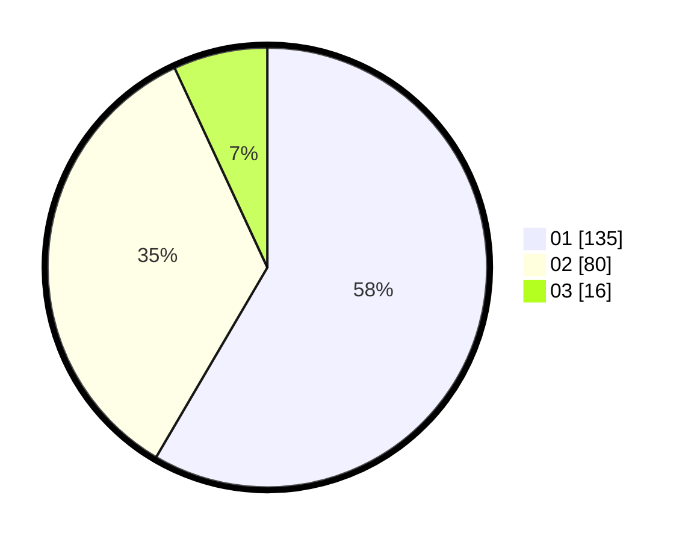

# Hasil

Hasil perolehan suara paslon dapat dilihat pada file paslon-01.txt, paslon-02.txt, dan paslon-03.txt.

Jika tidak ada, artinya data tersebut belum ada pada SIREKAP.

## Perolehan Suara

 * Paslon 01: **135**.
 * Paslon 02: **80**.
 * Paslon 03: **16**.

## Foto C Plano

https://sirekap-obj-formc.kpu.go.id/e119/pemilu/ppwp/31/71/06/10/02/3171061002074-20240215-204427--1ace575b-567b-4615-808d-539b1d07d525.jpg

https://sirekap-obj-formc.kpu.go.id/e119/pemilu/ppwp/31/71/06/10/02/3171061002074-20240215-204429--d84a92b3-38fe-44af-8eaa-501bf5e68be0.jpg

https://sirekap-obj-formc.kpu.go.id/e119/pemilu/ppwp/31/71/06/10/02/3171061002074-20240215-204428--5a4e68fb-0dac-4583-8c81-e14b93bbb59c.jpg

## DATA PEMILIH TETAP

Jumlah pemilih dalam DPT: **287**.
 * L: **141**.
 * P: **146**.

## DATA PENGGUNA HAK PILIH

Jumlah pengguna hak pilih dalam DPT: **234**.
 * L: **112**.
 * P: **122**.

Jumlah pengguna hak pilih dalam DPTb: **1**.
 * L: **1**.
 * P: **0**.

Jumlah pengguna hak pilih dalam DPK: **2**.
 * L: **0**.
 * P: **2**.

Jumlah pengguna hak pilih: **237**.
 * L: **113**.
 * P: **124**.

## JUMLAH SUARA SAH DAN TIDAK SAH

JUMLAH SELURUH SUARA SAH: **231**.

JUMLAH SUARA TIDAK SAH: **6**.

JUMLAH SELURUH SUARA SAH DAN SUARA TIDAK SAH: **237**.
