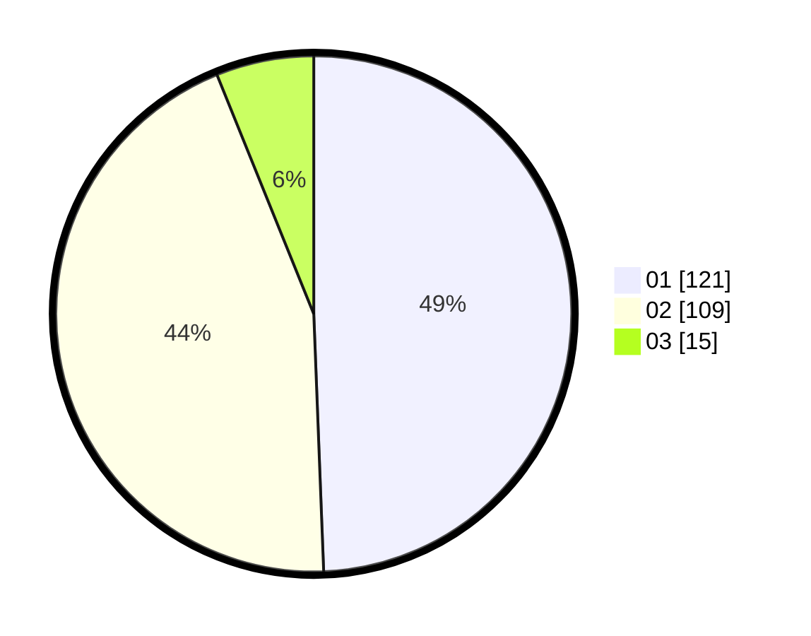

# Hasil

Hasil perolehan suara paslon dapat dilihat pada file paslon-01.txt, paslon-02.txt, dan paslon-03.txt.

Jika tidak ada, artinya data tersebut belum ada pada SIREKAP.

## Perolehan Suara

 * Paslon 01: **121**.
 * Paslon 02: **109**.
 * Paslon 03: **15**.

## Foto C Plano

https://sirekap-obj-formc.kpu.go.id/cde2/pemilu/ppwp/31/71/06/10/02/3171061002077-20240214-221125--d2d86089-653d-4f3f-8d92-5d57bc93ded8.jpg

https://sirekap-obj-formc.kpu.go.id/cde2/pemilu/ppwp/31/71/06/10/02/3171061002077-20240214-222402--2209eada-7843-46e7-8c7d-f8f4095fd42b.jpg

https://sirekap-obj-formc.kpu.go.id/cde2/pemilu/ppwp/31/71/06/10/02/3171061002077-20240214-210331--cae15e6e-73f7-44b5-b63f-79c5ac219707.jpg

## DATA PEMILIH TETAP

Jumlah pemilih dalam DPT: **294**.
 * L: **144**.
 * P: **150**.

## DATA PENGGUNA HAK PILIH

Jumlah pengguna hak pilih dalam DPT: **244**.
 * L: **127**.
 * P: **117**.

Jumlah pengguna hak pilih dalam DPTb: **2**.
 * L: **1**.
 * P: **1**.

Jumlah pengguna hak pilih dalam DPK: **3**.
 * L: **2**.
 * P: **1**.

Jumlah pengguna hak pilih: **249**.
 * L: **130**.
 * P: **119**.

## JUMLAH SUARA SAH DAN TIDAK SAH

JUMLAH SELURUH SUARA SAH: **245**.

JUMLAH SUARA TIDAK SAH: **4**.

JUMLAH SELURUH SUARA SAH DAN SUARA TIDAK SAH: **249**.
