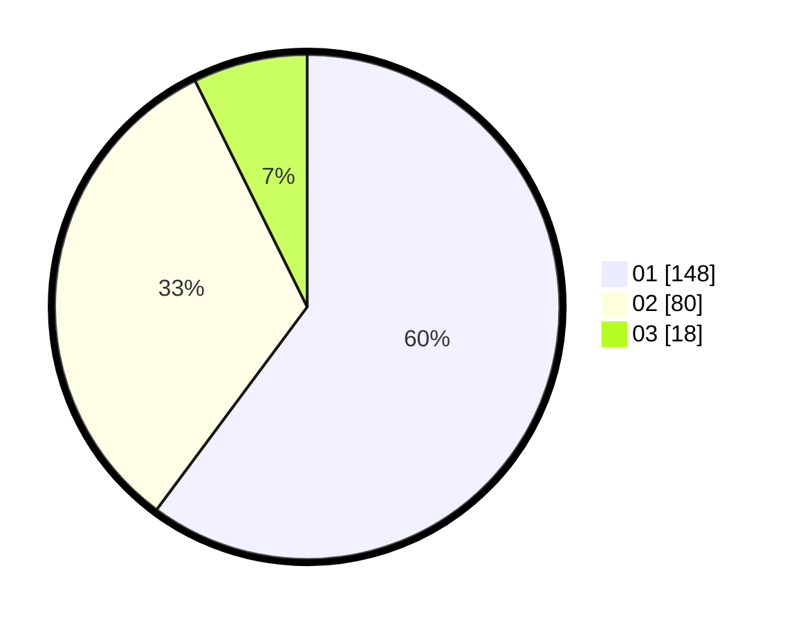

# Hasil

Hasil perolehan suara paslon dapat dilihat pada file paslon-01.txt, paslon-02.txt, dan paslon-03.txt.

Jika tidak ada, artinya data tersebut belum ada pada SIREKAP.

## Perolehan Suara

 * Paslon 01: **148**.
 * Paslon 02: **80**.
 * Paslon 03: **18**.

## Foto C Plano

https://sirekap-obj-formc.kpu.go.id/f2ab/pemilu/ppwp/31/71/06/10/02/3171061002079-20240214-195457--aa1bae94-10e9-4798-96a3-a88e8a86e66d.jpg

https://sirekap-obj-formc.kpu.go.id/f2ab/pemilu/ppwp/31/71/06/10/02/3171061002079-20240214-195713--d92da2ab-da2d-4fc1-b42f-1134d0080546.jpg

https://sirekap-obj-formc.kpu.go.id/f2ab/pemilu/ppwp/31/71/06/10/02/3171061002079-20240214-195828--367ad322-41df-4a43-a0ed-6030a6789f4b.jpg

## DATA PEMILIH TETAP

Jumlah pemilih dalam DPT: **296**.
 * L: **151**.
 * P: **145**.

## DATA PENGGUNA HAK PILIH

Jumlah pengguna hak pilih dalam DPT: **250**.
 * L: **123**.
 * P: **127**.

Jumlah pengguna hak pilih dalam DPTb: **0**.
 * L: **0**.
 * P: **0**.

Jumlah pengguna hak pilih dalam DPK: **1**.
 * L: **0**.
 * P: **1**.

Jumlah pengguna hak pilih: **251**.
 * L: **123**.
 * P: **128**.

## JUMLAH SUARA SAH DAN TIDAK SAH

JUMLAH SELURUH SUARA SAH: **246**.

JUMLAH SUARA TIDAK SAH: **5**.

JUMLAH SELURUH SUARA SAH DAN SUARA TIDAK SAH: **251**.
