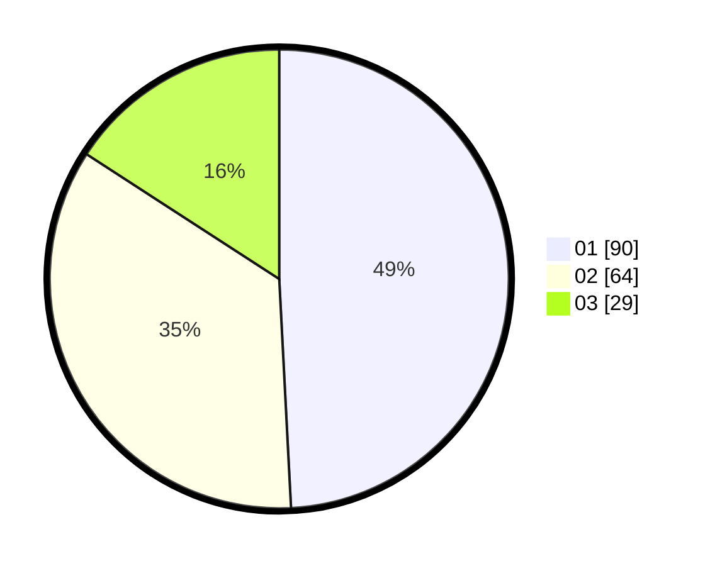

# Hasil

Hasil perolehan suara paslon dapat dilihat pada file paslon-01.txt, paslon-02.txt, dan paslon-03.txt.

Jika tidak ada, artinya data tersebut belum ada pada SIREKAP.

## Perolehan Suara

 * Paslon 01: **90**.
 * Paslon 02: **64**.
 * Paslon 03: **29**.

## Foto C Plano

https://sirekap-obj-formc.kpu.go.id/ae8e/pemilu/ppwp/31/71/06/10/03/3171061003009-20240217-010030--7894f910-763f-4b21-bb2b-641fb06781ae.jpg

https://sirekap-obj-formc.kpu.go.id/ae8e/pemilu/ppwp/31/71/06/10/03/3171061003009-20240217-010031--36618211-bec5-47d3-93b7-19dad71c46ee.jpg

https://sirekap-obj-formc.kpu.go.id/ae8e/pemilu/ppwp/31/71/06/10/03/3171061003009-20240214-222740--b07a9312-2264-4e3b-bfc6-b051cdc5fa39.jpg

## DATA PEMILIH TETAP

Jumlah pemilih dalam DPT: **166**.
 * L: **80**.
 * P: **86**.

## DATA PENGGUNA HAK PILIH

Jumlah pengguna hak pilih dalam DPT: **166**.
 * L: **80**.
 * P: **86**.

Jumlah pengguna hak pilih dalam DPTb: **16**.
 * L: **5**.
 * P: **11**.

Jumlah pengguna hak pilih dalam DPK: **3**.
 * L: **0**.
 * P: **3**.

Jumlah pengguna hak pilih: **185**.
 * L: **85**.
 * P: **100**.

## JUMLAH SUARA SAH DAN TIDAK SAH

JUMLAH SELURUH SUARA SAH: **183**.

JUMLAH SUARA TIDAK SAH: **2**.

JUMLAH SELURUH SUARA SAH DAN SUARA TIDAK SAH: **185**.
