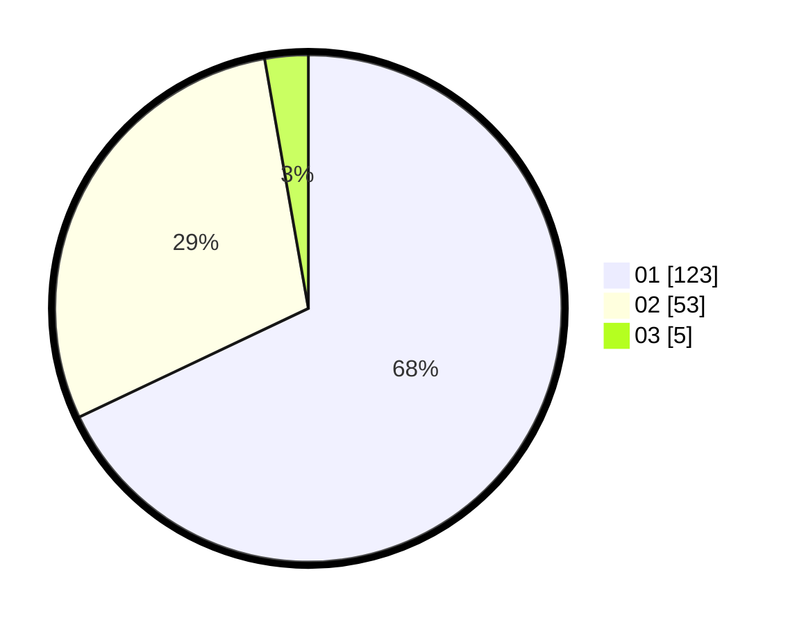

# Hasil

Hasil perolehan suara paslon dapat dilihat pada file paslon-01.txt, paslon-02.txt, dan paslon-03.txt.

Jika tidak ada, artinya data tersebut belum ada pada SIREKAP.

## Perolehan Suara

 * Paslon 01: **123**.
 * Paslon 02: **53**.
 * Paslon 03: **5**.

## Foto C Plano

https://sirekap-obj-formc.kpu.go.id/3e7c/pemilu/ppwp/31/71/06/10/03/3171061003010-20240217-001141--547f30c8-f77d-435f-a305-a45fd85a40fb.jpg

https://sirekap-obj-formc.kpu.go.id/3e7c/pemilu/ppwp/31/71/06/10/03/3171061003010-20240217-000552--2cbdfc2a-1b1b-453b-88af-dd5837b9e4f5.jpg

https://sirekap-obj-formc.kpu.go.id/3e7c/pemilu/ppwp/31/71/06/10/03/3171061003010-20240217-001344--13e30383-8c61-48af-9398-061d4e9d8165.jpg

## DATA PEMILIH TETAP

Jumlah pemilih dalam DPT: **233**.
 * L: **122**.
 * P: **111**.

## DATA PENGGUNA HAK PILIH

Jumlah pengguna hak pilih dalam DPT: **172**.
 * L: **84**.
 * P: **88**.

Jumlah pengguna hak pilih dalam DPTb: **9**.
 * L: **4**.
 * P: **5**.

Jumlah pengguna hak pilih dalam DPK: **2**.
 * L: **0**.
 * P: **2**.

Jumlah pengguna hak pilih: **183**.
 * L: **88**.
 * P: **95**.

## JUMLAH SUARA SAH DAN TIDAK SAH

JUMLAH SELURUH SUARA SAH: **181**.

JUMLAH SUARA TIDAK SAH: **2**.

JUMLAH SELURUH SUARA SAH DAN SUARA TIDAK SAH: **183**.
