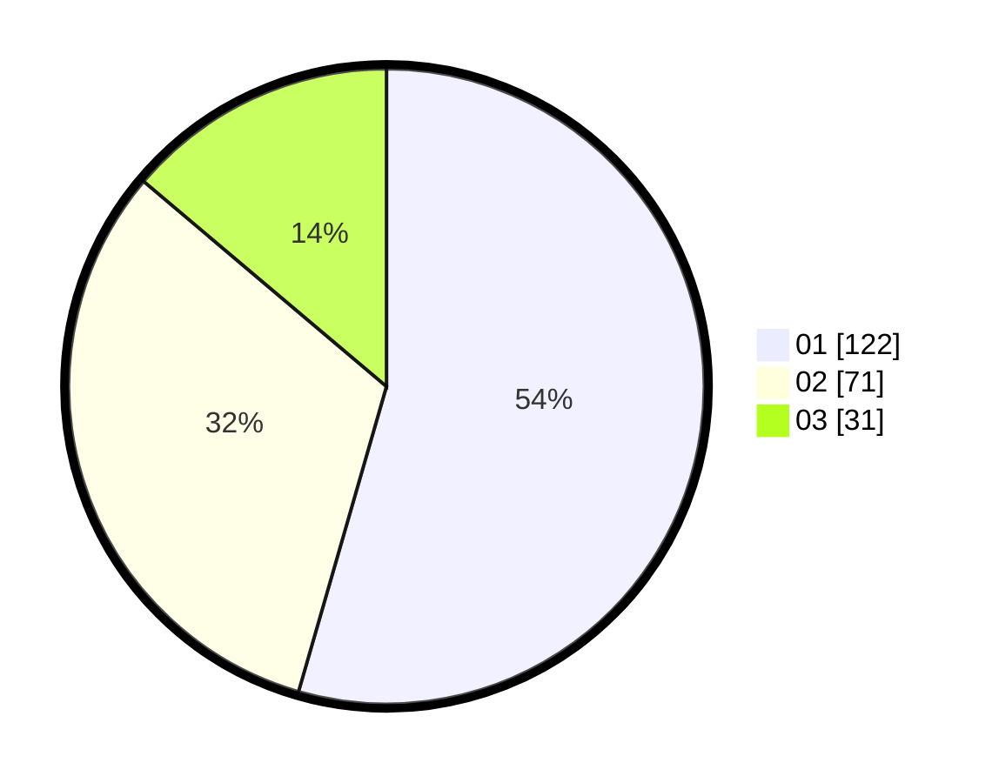

# Hasil

Hasil perolehan suara paslon dapat dilihat pada file paslon-01.txt, paslon-02.txt, dan paslon-03.txt.

Jika tidak ada, artinya data tersebut belum ada pada SIREKAP.

## Perolehan Suara

 * Paslon 01: **122**.
 * Paslon 02: **71**.
 * Paslon 03: **31**.

## Foto C Plano

https://sirekap-obj-formc.kpu.go.id/8944/pemilu/ppwp/31/71/06/10/03/3171061003016-20240216-154859--2f56f7ef-a5a3-400c-bdd6-14140f6b3fe8.jpg

https://sirekap-obj-formc.kpu.go.id/8944/pemilu/ppwp/31/71/06/10/03/3171061003016-20240216-154900--4bc60c9d-334d-4b8d-9ebd-85b97b2df04a.jpg

https://sirekap-obj-formc.kpu.go.id/8944/pemilu/ppwp/31/71/06/10/03/3171061003016-20240216-154900--c8f6359f-dbcb-42c2-a7c1-058eedf85085.jpg

## DATA PEMILIH TETAP

Jumlah pemilih dalam DPT: **266**.
 * L: **134**.
 * P: **132**.

## DATA PENGGUNA HAK PILIH

Jumlah pengguna hak pilih dalam DPT: **217**.
 * L: **106**.
 * P: **111**.

Jumlah pengguna hak pilih dalam DPTb: **5**.
 * L: **1**.
 * P: **4**.

Jumlah pengguna hak pilih dalam DPK: **5**.
 * L: **2**.
 * P: **3**.

Jumlah pengguna hak pilih: **227**.
 * L: **109**.
 * P: **118**.

## JUMLAH SUARA SAH DAN TIDAK SAH

JUMLAH SELURUH SUARA SAH: **224**.

JUMLAH SUARA TIDAK SAH: **3**.

JUMLAH SELURUH SUARA SAH DAN SUARA TIDAK SAH: **227**.
