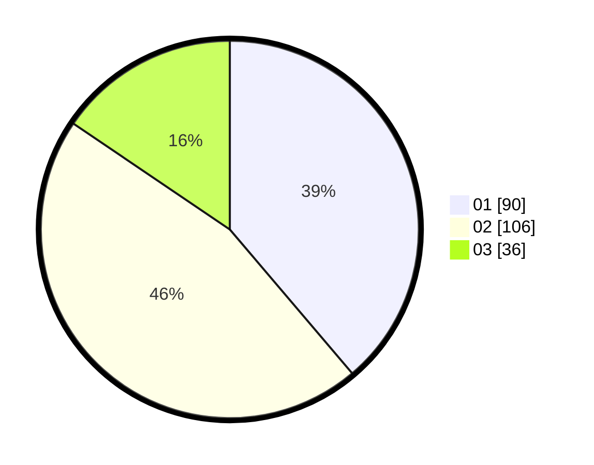

# Hasil

Hasil perolehan suara paslon dapat dilihat pada file paslon-01.txt, paslon-02.txt, dan paslon-03.txt.

Jika tidak ada, artinya data tersebut belum ada pada SIREKAP.

## Perolehan Suara

 * Paslon 01: **90**.
 * Paslon 02: **106**.
 * Paslon 03: **36**.

## Foto C Plano

https://sirekap-obj-formc.kpu.go.id/6ff1/pemilu/ppwp/31/71/06/10/03/3171061003018-20240216-215019--cb552c86-2e27-4741-9768-8dd762f6e12c.jpg

https://sirekap-obj-formc.kpu.go.id/6ff1/pemilu/ppwp/31/71/06/10/03/3171061003018-20240216-215243--9064272f-a4bf-475d-a679-781f7daaf06b.jpg

https://sirekap-obj-formc.kpu.go.id/6ff1/pemilu/ppwp/31/71/06/10/03/3171061003018-20240216-204727--ad757d91-398b-4fae-86bd-eebe58b58a02.jpg

## DATA PEMILIH TETAP

Jumlah pemilih dalam DPT: **272**.
 * L: **130**.
 * P: **142**.

## DATA PENGGUNA HAK PILIH

Jumlah pengguna hak pilih dalam DPT: **214**.
 * L: **103**.
 * P: **111**.

Jumlah pengguna hak pilih dalam DPTb: **16**.
 * L: **6**.
 * P: **10**.

Jumlah pengguna hak pilih dalam DPK: **3**.
 * L: **2**.
 * P: **1**.

Jumlah pengguna hak pilih: **233**.
 * L: **111**.
 * P: **122**.

## JUMLAH SUARA SAH DAN TIDAK SAH

JUMLAH SELURUH SUARA SAH: **232**.

JUMLAH SUARA TIDAK SAH: **1**.

JUMLAH SELURUH SUARA SAH DAN SUARA TIDAK SAH: **233**.
