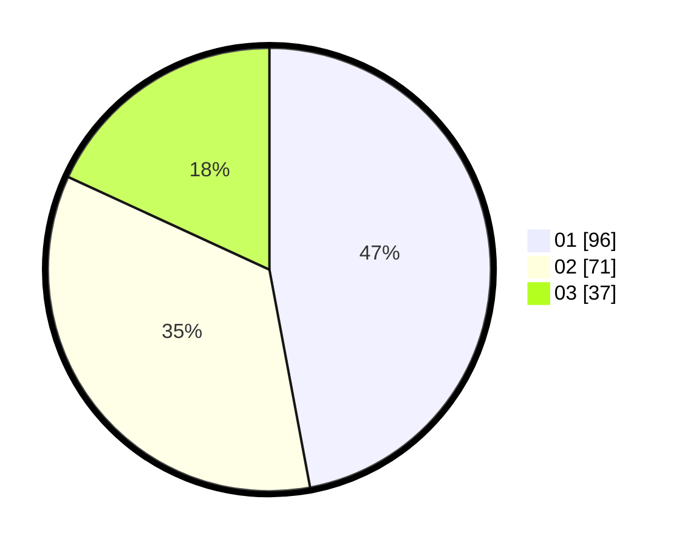

# Hasil

Hasil perolehan suara paslon dapat dilihat pada file paslon-01.txt, paslon-02.txt, dan paslon-03.txt.

Jika tidak ada, artinya data tersebut belum ada pada SIREKAP.

## Perolehan Suara

 * Paslon 01: **96**.
 * Paslon 02: **71**.
 * Paslon 03: **37**.

## Foto C Plano

https://sirekap-obj-formc.kpu.go.id/7881/pemilu/ppwp/31/71/06/10/03/3171061003019-20240217-131456--dca39947-2142-4480-814e-ea6a5271f1ae.jpg

https://sirekap-obj-formc.kpu.go.id/7881/pemilu/ppwp/31/71/06/10/03/3171061003019-20240217-131703--3c1d551b-5cd8-44a3-8e12-d5a55340302a.jpg

https://sirekap-obj-formc.kpu.go.id/7881/pemilu/ppwp/31/71/06/10/03/3171061003019-20240217-131838--d3405e62-1efd-4eb6-81f4-92bbde2f9919.jpg

## DATA PEMILIH TETAP

Jumlah pemilih dalam DPT: **267**.
 * L: **122**.
 * P: **145**.

## DATA PENGGUNA HAK PILIH

Jumlah pengguna hak pilih dalam DPT: **195**.
 * L: **84**.
 * P: **111**.

Jumlah pengguna hak pilih dalam DPTb: **16**.
 * L: **3**.
 * P: **13**.

Jumlah pengguna hak pilih dalam DPK: **0**.
 * L: **0**.
 * P: **0**.

Jumlah pengguna hak pilih: **211**.
 * L: **87**.
 * P: **124**.

## JUMLAH SUARA SAH DAN TIDAK SAH

JUMLAH SELURUH SUARA SAH: **204**.

JUMLAH SUARA TIDAK SAH: **7**.

JUMLAH SELURUH SUARA SAH DAN SUARA TIDAK SAH: **211**.
