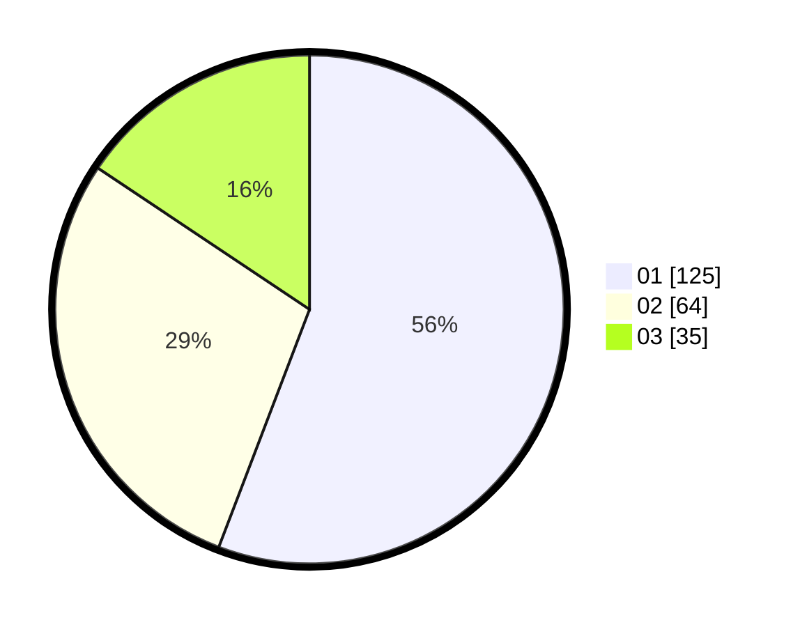

# Hasil

Hasil perolehan suara paslon dapat dilihat pada file paslon-01.txt, paslon-02.txt, dan paslon-03.txt.

Jika tidak ada, artinya data tersebut belum ada pada SIREKAP.

## Perolehan Suara

 * Paslon 01: **125**.
 * Paslon 02: **64**.
 * Paslon 03: **35**.

## Foto C Plano

https://sirekap-obj-formc.kpu.go.id/eff4/pemilu/ppwp/31/71/06/10/03/3171061003021-20240216-185806--447e3ef1-56ef-4e81-af61-7bbf349fa0df.jpg

https://sirekap-obj-formc.kpu.go.id/eff4/pemilu/ppwp/31/71/06/10/03/3171061003021-20240216-194343--66f4a2af-8f92-405a-ad9c-be65613b9087.jpg

https://sirekap-obj-formc.kpu.go.id/eff4/pemilu/ppwp/31/71/06/10/03/3171061003021-20240216-190100--694dffcc-f750-4ae5-8214-be9d708331fd.jpg

## DATA PEMILIH TETAP

Jumlah pemilih dalam DPT: **261**.
 * L: **132**.
 * P: **129**.

## DATA PENGGUNA HAK PILIH

Jumlah pengguna hak pilih dalam DPT: **200**.
 * L: **100**.
 * P: **100**.

Jumlah pengguna hak pilih dalam DPTb: **23**.
 * L: **5**.
 * P: **18**.

Jumlah pengguna hak pilih dalam DPK: **1**.
 * L: **0**.
 * P: **1**.

Jumlah pengguna hak pilih: **224**.
 * L: **105**.
 * P: **119**.

## JUMLAH SUARA SAH DAN TIDAK SAH

JUMLAH SELURUH SUARA SAH: **224**.

JUMLAH SUARA TIDAK SAH: **0**.

JUMLAH SELURUH SUARA SAH DAN SUARA TIDAK SAH: **224**.
