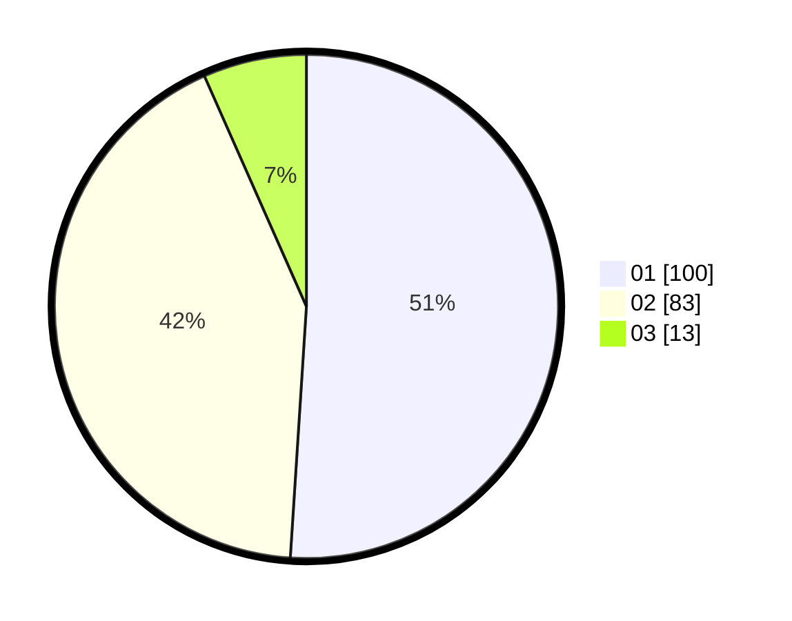

# Hasil

Hasil perolehan suara paslon dapat dilihat pada file paslon-01.txt, paslon-02.txt, dan paslon-03.txt.

Jika tidak ada, artinya data tersebut belum ada pada SIREKAP.

## Perolehan Suara

 * Paslon 01: **100**.
 * Paslon 02: **83**.
 * Paslon 03: **13**.

## Foto C Plano

https://sirekap-obj-formc.kpu.go.id/9ec7/pemilu/ppwp/31/71/06/10/03/3171061003022-20240214-155104--6837eab6-f488-4b78-adab-4a0f98a0521d.jpg

https://sirekap-obj-formc.kpu.go.id/9ec7/pemilu/ppwp/31/71/06/10/03/3171061003022-20240214-155235--22649e45-114c-4927-a4c9-d8f3bd59e797.jpg

https://sirekap-obj-formc.kpu.go.id/9ec7/pemilu/ppwp/31/71/06/10/03/3171061003022-20240214-155253--278c5b44-75d3-4a08-93a5-5d5f1aeda9c7.jpg

## DATA PEMILIH TETAP

Jumlah pemilih dalam DPT: **242**.
 * L: **112**.
 * P: **130**.

## DATA PENGGUNA HAK PILIH

Jumlah pengguna hak pilih dalam DPT: **192**.
 * L: **90**.
 * P: **102**.

Jumlah pengguna hak pilih dalam DPTb: **6**.
 * L: **1**.
 * P: **5**.

Jumlah pengguna hak pilih dalam DPK: **1**.
 * L: **1**.
 * P: **0**.

Jumlah pengguna hak pilih: **199**.
 * L: **92**.
 * P: **107**.

## JUMLAH SUARA SAH DAN TIDAK SAH

JUMLAH SELURUH SUARA SAH: **196**.

JUMLAH SUARA TIDAK SAH: **3**.

JUMLAH SELURUH SUARA SAH DAN SUARA TIDAK SAH: **199**.
