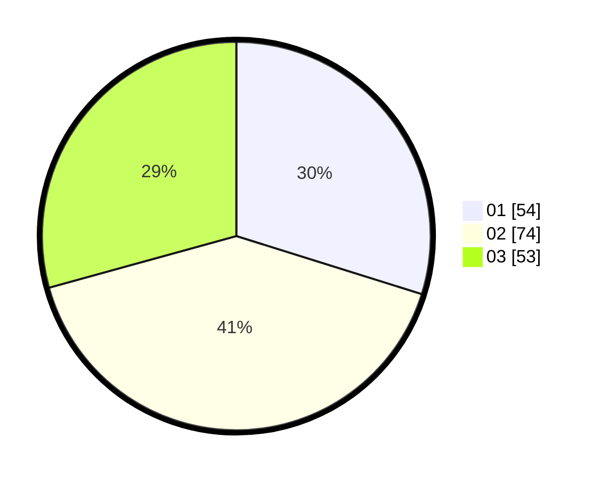

# Hasil

Hasil perolehan suara paslon dapat dilihat pada file paslon-01.txt, paslon-02.txt, dan paslon-03.txt.

Jika tidak ada, artinya data tersebut belum ada pada SIREKAP.

## Perolehan Suara

 * Paslon 01: **54**.
 * Paslon 02: **74**.
 * Paslon 03: **53**.

## Foto C Plano

https://sirekap-obj-formc.kpu.go.id/3e96/pemilu/ppwp/31/71/06/10/03/3171061003029-20240217-102146--aaef01b3-e4aa-41ef-aed3-ad429dab805e.jpg

https://sirekap-obj-formc.kpu.go.id/3e96/pemilu/ppwp/31/71/06/10/03/3171061003029-20240217-103631--7fda21dd-1e2a-4120-9fda-908fe4171f05.jpg

https://sirekap-obj-formc.kpu.go.id/3e96/pemilu/ppwp/31/71/06/10/03/3171061003029-20240217-104852--c4c7e0a4-1ba4-4820-bb10-1327cd24ef25.jpg

## DATA PEMILIH TETAP

Jumlah pemilih dalam DPT: **225**.
 * L: **109**.
 * P: **116**.

## DATA PENGGUNA HAK PILIH

Jumlah pengguna hak pilih dalam DPT: **163**.
 * L: **81**.
 * P: **82**.

Jumlah pengguna hak pilih dalam DPTb: **16**.
 * L: **5**.
 * P: **11**.

Jumlah pengguna hak pilih dalam DPK: **7**.
 * L: **4**.
 * P: **3**.

Jumlah pengguna hak pilih: **186**.
 * L: **90**.
 * P: **96**.

## JUMLAH SUARA SAH DAN TIDAK SAH

JUMLAH SELURUH SUARA SAH: **181**.

JUMLAH SUARA TIDAK SAH: **5**.

JUMLAH SELURUH SUARA SAH DAN SUARA TIDAK SAH: **186**.
