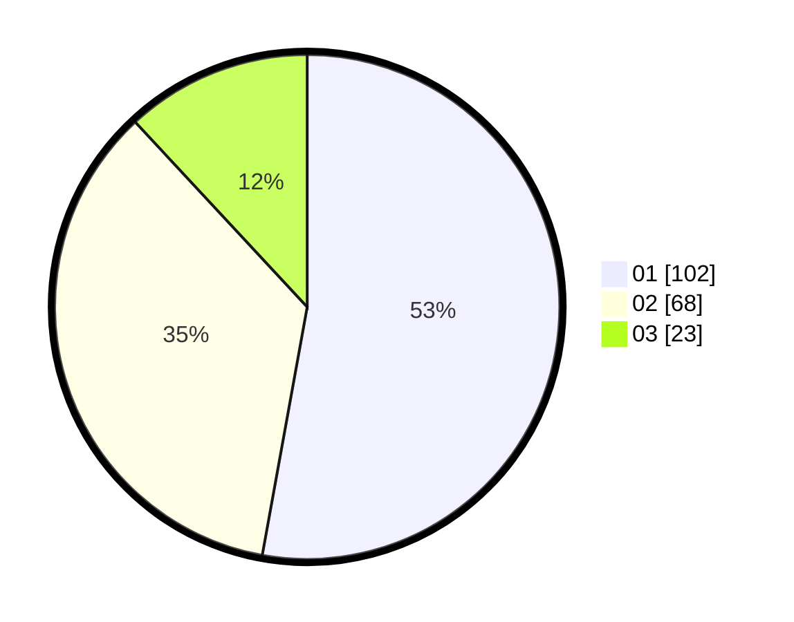

# Hasil

Hasil perolehan suara paslon dapat dilihat pada file paslon-01.txt, paslon-02.txt, dan paslon-03.txt.

Jika tidak ada, artinya data tersebut belum ada pada SIREKAP.

## Perolehan Suara

 * Paslon 01: **102**.
 * Paslon 02: **68**.
 * Paslon 03: **23**.

## Foto C Plano

https://sirekap-obj-formc.kpu.go.id/39af/pemilu/ppwp/31/71/06/10/03/3171061003030-20240217-183729--4cb3e777-a524-4893-8632-cf384111f620.jpg

https://sirekap-obj-formc.kpu.go.id/39af/pemilu/ppwp/31/71/06/10/03/3171061003030-20240217-183731--958bb4bd-91bd-4c72-b9aa-883440f309c9.jpg

https://sirekap-obj-formc.kpu.go.id/39af/pemilu/ppwp/31/71/06/10/03/3171061003030-20240217-183730--c3bec2b6-1194-4153-87fa-0f35b85ff526.jpg

## DATA PEMILIH TETAP

Jumlah pemilih dalam DPT: **0**.
 * L: **0**.
 * P: **0**.

## DATA PENGGUNA HAK PILIH

Jumlah pengguna hak pilih dalam DPT: **0**.
 * L: **0**.
 * P: **0**.

Jumlah pengguna hak pilih dalam DPTb: **0**.
 * L: **0**.
 * P: **0**.

Jumlah pengguna hak pilih dalam DPK: **0**.
 * L: **0**.
 * P: **0**.

Jumlah pengguna hak pilih: **0**.
 * L: **0**.
 * P: **0**.

## JUMLAH SUARA SAH DAN TIDAK SAH

JUMLAH SELURUH SUARA SAH: **193**.

JUMLAH SUARA TIDAK SAH: **0**.

JUMLAH SELURUH SUARA SAH DAN SUARA TIDAK SAH: **193**.
