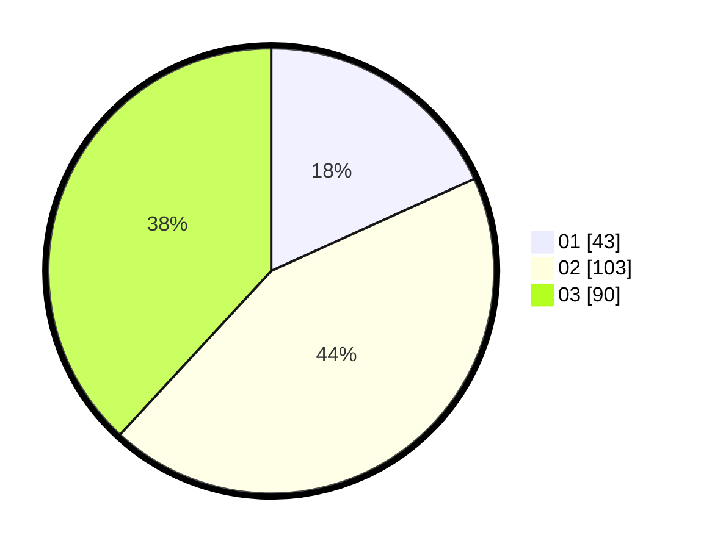

# Hasil

Hasil perolehan suara paslon dapat dilihat pada file paslon-01.txt, paslon-02.txt, dan paslon-03.txt.

Jika tidak ada, artinya data tersebut belum ada pada SIREKAP.

## Perolehan Suara

 * Paslon 01: **43**.
 * Paslon 02: **103**.
 * Paslon 03: **90**.

## Foto C Plano

https://sirekap-obj-formc.kpu.go.id/9a98/pemilu/ppwp/31/71/06/10/04/3171061004002-20240216-152243--766b2995-6977-4619-9389-d6908afaef7c.jpg

https://sirekap-obj-formc.kpu.go.id/9a98/pemilu/ppwp/31/71/06/10/04/3171061004002-20240216-152244--0c78d4b4-432c-4b7c-a736-a4723c401e10.jpg

https://sirekap-obj-formc.kpu.go.id/9a98/pemilu/ppwp/31/71/06/10/04/3171061004002-20240216-152244--c761f22a-5f4e-469b-b52f-8b477c3980f1.jpg

## DATA PEMILIH TETAP

Jumlah pemilih dalam DPT: **283**.
 * L: **127**.
 * P: **156**.

## DATA PENGGUNA HAK PILIH

Jumlah pengguna hak pilih dalam DPT: **210**.
 * L: **94**.
 * P: **116**.

Jumlah pengguna hak pilih dalam DPTb: **19**.
 * L: **6**.
 * P: **13**.

Jumlah pengguna hak pilih dalam DPK: **14**.
 * L: **7**.
 * P: **7**.

Jumlah pengguna hak pilih: **243**.
 * L: **107**.
 * P: **136**.

## JUMLAH SUARA SAH DAN TIDAK SAH

JUMLAH SELURUH SUARA SAH: **236**.

JUMLAH SUARA TIDAK SAH: **7**.

JUMLAH SELURUH SUARA SAH DAN SUARA TIDAK SAH: **243**.
