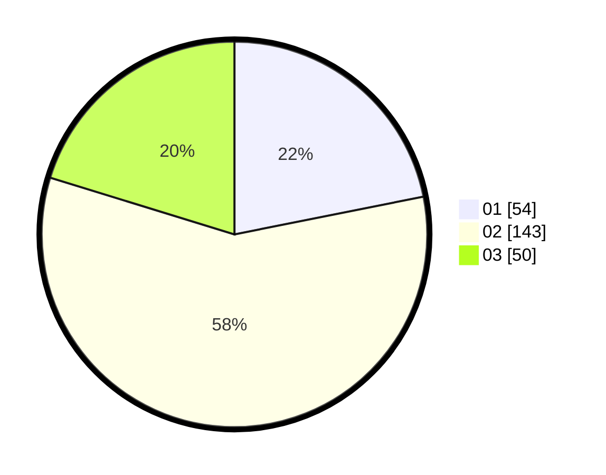

# Hasil

Hasil perolehan suara paslon dapat dilihat pada file paslon-01.txt, paslon-02.txt, dan paslon-03.txt.

Jika tidak ada, artinya data tersebut belum ada pada SIREKAP.

## Perolehan Suara

 * Paslon 01: **54**.
 * Paslon 02: **143**.
 * Paslon 03: **50**.

## Foto C Plano

https://sirekap-obj-formc.kpu.go.id/33cf/pemilu/ppwp/31/71/06/10/04/3171061004004-20240214-192805--cb2e065c-f298-4c0e-a904-7519cd831998.jpg

https://sirekap-obj-formc.kpu.go.id/33cf/pemilu/ppwp/31/71/06/10/04/3171061004004-20240214-192905--3598ebcc-878c-47f9-a327-6683a202108d.jpg

https://sirekap-obj-formc.kpu.go.id/33cf/pemilu/ppwp/31/71/06/10/04/3171061004004-20240214-193014--fcd5d49e-eca0-4c0f-aeb5-4ba265596908.jpg
