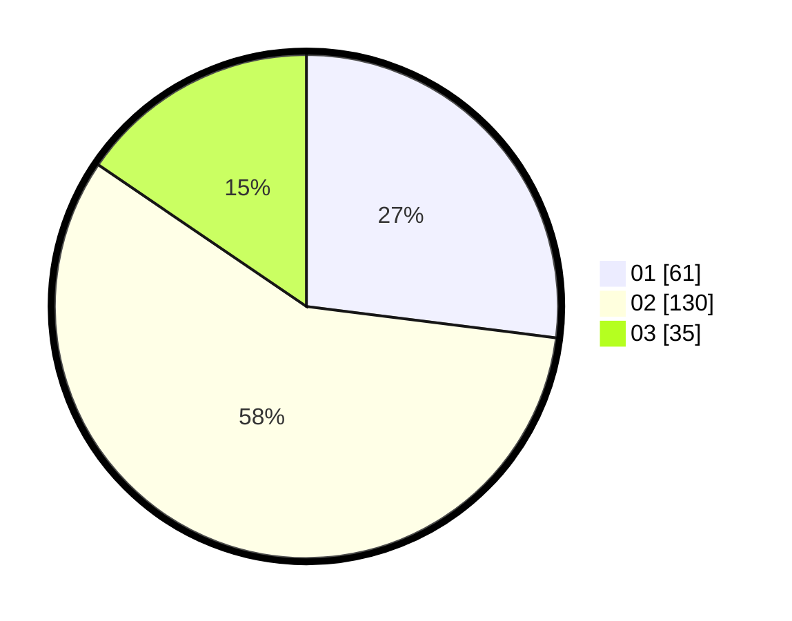

# Hasil

Hasil perolehan suara paslon dapat dilihat pada file paslon-01.txt, paslon-02.txt, dan paslon-03.txt.

Jika tidak ada, artinya data tersebut belum ada pada SIREKAP.

## Perolehan Suara

 * Paslon 01: **61**.
 * Paslon 02: **130**.
 * Paslon 03: **35**.

## Foto C Plano

https://sirekap-obj-formc.kpu.go.id/3b8d/pemilu/ppwp/31/71/06/10/04/3171061004005-20240216-013941--c8ede8cb-4787-4464-8240-b6efe4f6dd22.jpg

https://sirekap-obj-formc.kpu.go.id/3b8d/pemilu/ppwp/31/71/06/10/04/3171061004005-20240214-155801--45447288-da49-41b8-91b0-885fcd134658.jpg

https://sirekap-obj-formc.kpu.go.id/3b8d/pemilu/ppwp/31/71/06/10/04/3171061004005-20240214-155909--0aafc1c8-21e3-47d1-9bd6-5384fddf1649.jpg

## DATA PEMILIH TETAP

Jumlah pemilih dalam DPT: **266**.
 * L: **111**.
 * P: **155**.

## DATA PENGGUNA HAK PILIH

Jumlah pengguna hak pilih dalam DPT: **193**.
 * L: **78**.
 * P: **115**.

Jumlah pengguna hak pilih dalam DPTb: **21**.
 * L: **8**.
 * P: **13**.

Jumlah pengguna hak pilih dalam DPK: **17**.
 * L: **6**.
 * P: **11**.

Jumlah pengguna hak pilih: **231**.
 * L: **92**.
 * P: **139**.

## JUMLAH SUARA SAH DAN TIDAK SAH

JUMLAH SELURUH SUARA SAH: **226**.

JUMLAH SUARA TIDAK SAH: **5**.

JUMLAH SELURUH SUARA SAH DAN SUARA TIDAK SAH: **231**.
