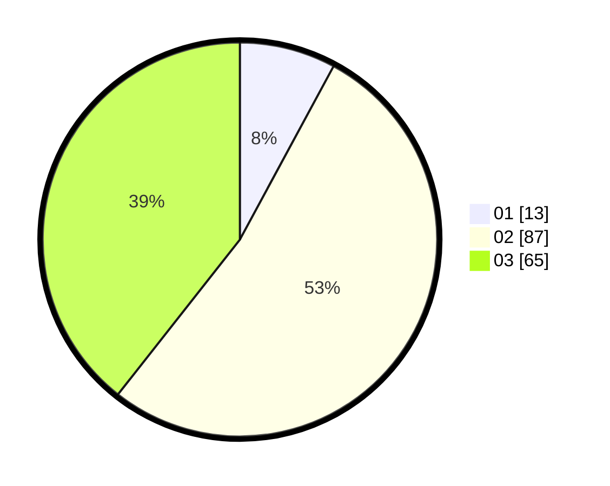

# Hasil

Hasil perolehan suara paslon dapat dilihat pada file paslon-01.txt, paslon-02.txt, dan paslon-03.txt.

Jika tidak ada, artinya data tersebut belum ada pada SIREKAP.

## Perolehan Suara

 * Paslon 01: **13**.
 * Paslon 02: **87**.
 * Paslon 03: **65**.

## Foto C Plano

https://sirekap-obj-formc.kpu.go.id/6f20/pemilu/ppwp/31/71/06/10/04/3171061004009-20240214-220035--e0f038a9-c995-460a-88a2-382aed285110.jpg

https://sirekap-obj-formc.kpu.go.id/6f20/pemilu/ppwp/31/71/06/10/04/3171061004009-20240214-194448--c1f3d0bf-0193-4b3c-b6fe-59064561ca89.jpg

https://sirekap-obj-formc.kpu.go.id/6f20/pemilu/ppwp/31/71/06/10/04/3171061004009-20240214-194717--2411fecd-f184-4c47-a5d6-07f54ba8aed1.jpg
