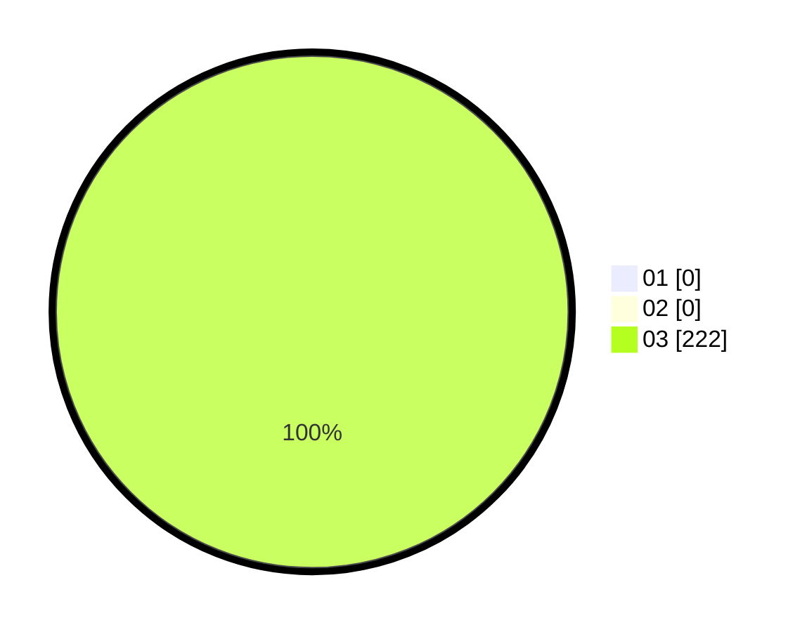

# Hasil

Hasil perolehan suara paslon dapat dilihat pada file paslon-01.txt, paslon-02.txt, dan paslon-03.txt.

Jika tidak ada, artinya data tersebut belum ada pada SIREKAP.

## Perolehan Suara

 * Paslon 01: **0**.
 * Paslon 02: **0**.
 * Paslon 03: **222**.

## Foto C Plano

https://sirekap-obj-formc.kpu.go.id/393d/pemilu/ppwp/31/71/06/10/04/3171061004013-20240216-223642--69d85a1d-3b37-4c33-a6b4-0e5bf0d2af96.jpg

https://sirekap-obj-formc.kpu.go.id/393d/pemilu/ppwp/31/71/06/10/04/3171061004013-20240216-223644--888ce172-ff7a-4579-82ab-53fb4b73252f.jpg

https://sirekap-obj-formc.kpu.go.id/393d/pemilu/ppwp/31/71/06/10/04/3171061004013-20240216-223643--f5dbd39c-69c3-47e5-8276-98cc904d39e6.jpg

## DATA PEMILIH TETAP

Jumlah pemilih dalam DPT: **273**.
 * L: **126**.
 * P: **147**.

## DATA PENGGUNA HAK PILIH

Jumlah pengguna hak pilih dalam DPT: **191**.
 * L: **88**.
 * P: **103**.

Jumlah pengguna hak pilih dalam DPTb: **17**.
 * L: **11**.
 * P: **6**.

Jumlah pengguna hak pilih dalam DPK: **6**.
 * L: **4**.
 * P: **2**.

Jumlah pengguna hak pilih: **214**.
 * L: **103**.
 * P: **111**.

## JUMLAH SUARA SAH DAN TIDAK SAH

JUMLAH SELURUH SUARA SAH: **213**.

JUMLAH SUARA TIDAK SAH: **1**.

JUMLAH SELURUH SUARA SAH DAN SUARA TIDAK SAH: **214**.
