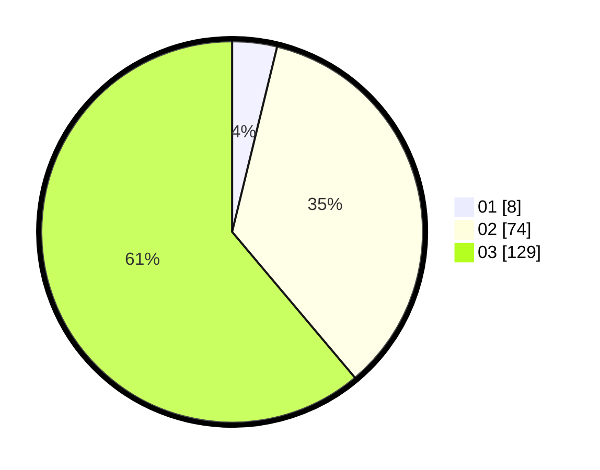

# Hasil

Hasil perolehan suara paslon dapat dilihat pada file paslon-01.txt, paslon-02.txt, dan paslon-03.txt.

Jika tidak ada, artinya data tersebut belum ada pada SIREKAP.

## Perolehan Suara

 * Paslon 01: **8**.
 * Paslon 02: **74**.
 * Paslon 03: **129**.

## Foto C Plano

https://sirekap-obj-formc.kpu.go.id/3760/pemilu/ppwp/31/71/06/10/05/3171061005001-20240214-194038--1f9261de-6ee4-4ce2-a79a-54039bbcd556.jpg

https://sirekap-obj-formc.kpu.go.id/3760/pemilu/ppwp/31/71/06/10/05/3171061005001-20240214-200431--763036d5-fa02-4ec7-99d0-f08400022f45.jpg

https://sirekap-obj-formc.kpu.go.id/3760/pemilu/ppwp/31/71/06/10/05/3171061005001-20240214-194713--bcdf7b3d-7358-4b51-a4f2-76fa3299c33b.jpg

## DATA PEMILIH TETAP

Jumlah pemilih dalam DPT: **270**.
 * L: **122**.
 * P: **148**.

## DATA PENGGUNA HAK PILIH

Jumlah pengguna hak pilih dalam DPT: **186**.
 * L: **87**.
 * P: **99**.

Jumlah pengguna hak pilih dalam DPTb: **25**.
 * L: **14**.
 * P: **11**.

Jumlah pengguna hak pilih dalam DPK: **5**.
 * L: **3**.
 * P: **2**.

Jumlah pengguna hak pilih: **216**.
 * L: **104**.
 * P: **112**.

## JUMLAH SUARA SAH DAN TIDAK SAH

JUMLAH SELURUH SUARA SAH: **211**.

JUMLAH SUARA TIDAK SAH: **5**.

JUMLAH SELURUH SUARA SAH DAN SUARA TIDAK SAH: **216**.
