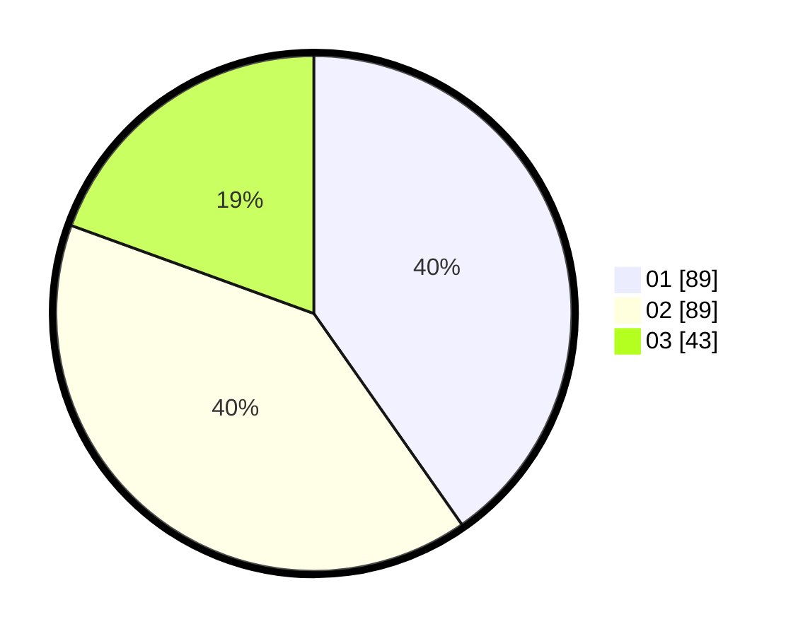

# Hasil

Hasil perolehan suara paslon dapat dilihat pada file paslon-01.txt, paslon-02.txt, dan paslon-03.txt.

Jika tidak ada, artinya data tersebut belum ada pada SIREKAP.

## Perolehan Suara

 * Paslon 01: **89**.
 * Paslon 02: **89**.
 * Paslon 03: **43**.

## Foto C Plano

https://sirekap-obj-formc.kpu.go.id/a99b/pemilu/ppwp/31/71/06/10/05/3171061005002-20240215-010451--cfb35924-e3e2-4054-af67-3e898c77634b.jpg

https://sirekap-obj-formc.kpu.go.id/a99b/pemilu/ppwp/31/71/06/10/05/3171061005002-20240215-010618--35b78a73-8a12-4c95-9bad-9e4e18b0b026.jpg

https://sirekap-obj-formc.kpu.go.id/a99b/pemilu/ppwp/31/71/06/10/05/3171061005002-20240215-010753--b9c75fc8-d342-4297-87aa-1d50085793c5.jpg

## DATA PEMILIH TETAP

Jumlah pemilih dalam DPT: **263**.
 * L: **128**.
 * P: **135**.

## DATA PENGGUNA HAK PILIH

Jumlah pengguna hak pilih dalam DPT: **201**.
 * L: **94**.
 * P: **107**.

Jumlah pengguna hak pilih dalam DPTb: **17**.
 * L: **10**.
 * P: **7**.

Jumlah pengguna hak pilih dalam DPK: **5**.
 * L: **4**.
 * P: **1**.

Jumlah pengguna hak pilih: **223**.
 * L: **108**.
 * P: **115**.

## JUMLAH SUARA SAH DAN TIDAK SAH

JUMLAH SELURUH SUARA SAH: **221**.

JUMLAH SUARA TIDAK SAH: **2**.

JUMLAH SELURUH SUARA SAH DAN SUARA TIDAK SAH: **223**.
