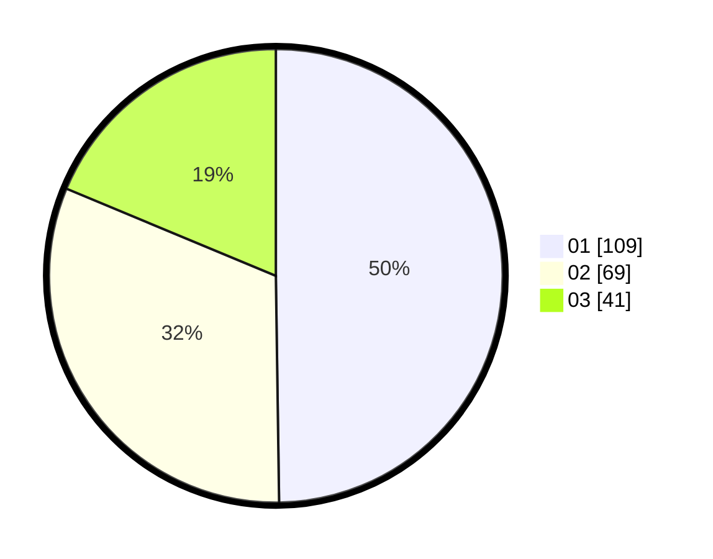

# Hasil

Hasil perolehan suara paslon dapat dilihat pada file paslon-01.txt, paslon-02.txt, dan paslon-03.txt.

Jika tidak ada, artinya data tersebut belum ada pada SIREKAP.

## Perolehan Suara

 * Paslon 01: **109**.
 * Paslon 02: **69**.
 * Paslon 03: **41**.

## Foto C Plano

https://sirekap-obj-formc.kpu.go.id/e172/pemilu/ppwp/31/71/06/10/05/3171061005007-20240216-192034--6e750f87-6fd2-4070-a9b3-8217315a0157.jpg

https://sirekap-obj-formc.kpu.go.id/e172/pemilu/ppwp/31/71/06/10/05/3171061005007-20240216-192132--3344ce50-5139-4940-8179-d56f0a38e557.jpg

https://sirekap-obj-formc.kpu.go.id/e172/pemilu/ppwp/31/71/06/10/05/3171061005007-20240216-192211--33ad7f48-f1ba-4c0b-a861-9abc8d7cc388.jpg
