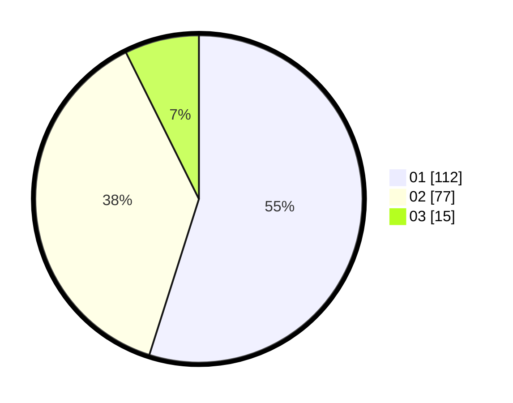

# Hasil

Hasil perolehan suara paslon dapat dilihat pada file paslon-01.txt, paslon-02.txt, dan paslon-03.txt.

Jika tidak ada, artinya data tersebut belum ada pada SIREKAP.

## Perolehan Suara

 * Paslon 01: **112**.
 * Paslon 02: **77**.
 * Paslon 03: **15**.

## Foto C Plano

https://sirekap-obj-formc.kpu.go.id/aae4/pemilu/ppwp/31/71/06/10/05/3171061005009-20240215-002249--b765a322-1a2e-4d07-b92a-6e979fdd624d.jpg

https://sirekap-obj-formc.kpu.go.id/aae4/pemilu/ppwp/31/71/06/10/05/3171061005009-20240215-002357--1a5883d9-71bf-408d-af0a-c8eaa00fc66a.jpg

https://sirekap-obj-formc.kpu.go.id/aae4/pemilu/ppwp/31/71/06/10/05/3171061005009-20240215-002503--3559f608-a9f6-401f-9a33-2b56a18db067.jpg
