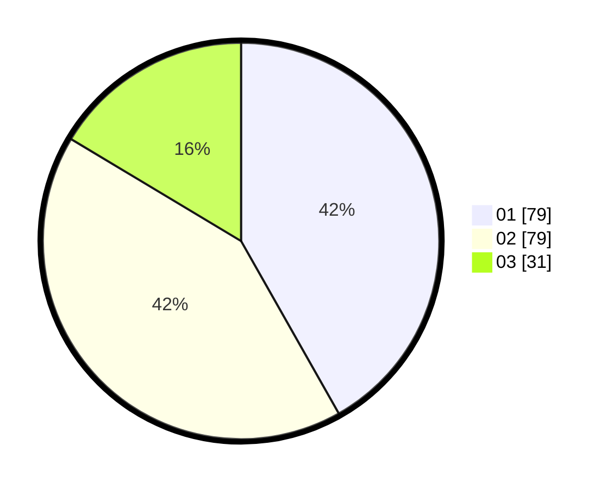

# Hasil

Hasil perolehan suara paslon dapat dilihat pada file paslon-01.txt, paslon-02.txt, dan paslon-03.txt.

Jika tidak ada, artinya data tersebut belum ada pada SIREKAP.

## Perolehan Suara

 * Paslon 01: **79**.
 * Paslon 02: **79**.
 * Paslon 03: **31**.

## Foto C Plano

https://sirekap-obj-formc.kpu.go.id/659c/pemilu/ppwp/31/71/06/10/05/3171061005010-20240216-035928--72f0a975-5846-4b15-8cbd-eec03c4313ac.jpg

https://sirekap-obj-formc.kpu.go.id/659c/pemilu/ppwp/31/71/06/10/05/3171061005010-20240216-042406--10c2252f-211d-4c31-9441-58beae81ff20.jpg

https://sirekap-obj-formc.kpu.go.id/659c/pemilu/ppwp/31/71/06/10/05/3171061005010-20240216-035929--1bb36476-8411-4603-a937-4bf45610a58f.jpg

## DATA PEMILIH TETAP

Jumlah pemilih dalam DPT: **0**.
 * L: **0**.
 * P: **0**.

## DATA PENGGUNA HAK PILIH

Jumlah pengguna hak pilih dalam DPT: **0**.
 * L: **0**.
 * P: **0**.

Jumlah pengguna hak pilih dalam DPTb: **0**.
 * L: **0**.
 * P: **0**.

Jumlah pengguna hak pilih dalam DPK: **0**.
 * L: **0**.
 * P: **0**.

Jumlah pengguna hak pilih: **0**.
 * L: **0**.
 * P: **0**.

## JUMLAH SUARA SAH DAN TIDAK SAH

JUMLAH SELURUH SUARA SAH: **189**.

JUMLAH SUARA TIDAK SAH: **5**.

JUMLAH SELURUH SUARA SAH DAN SUARA TIDAK SAH: **194**.
