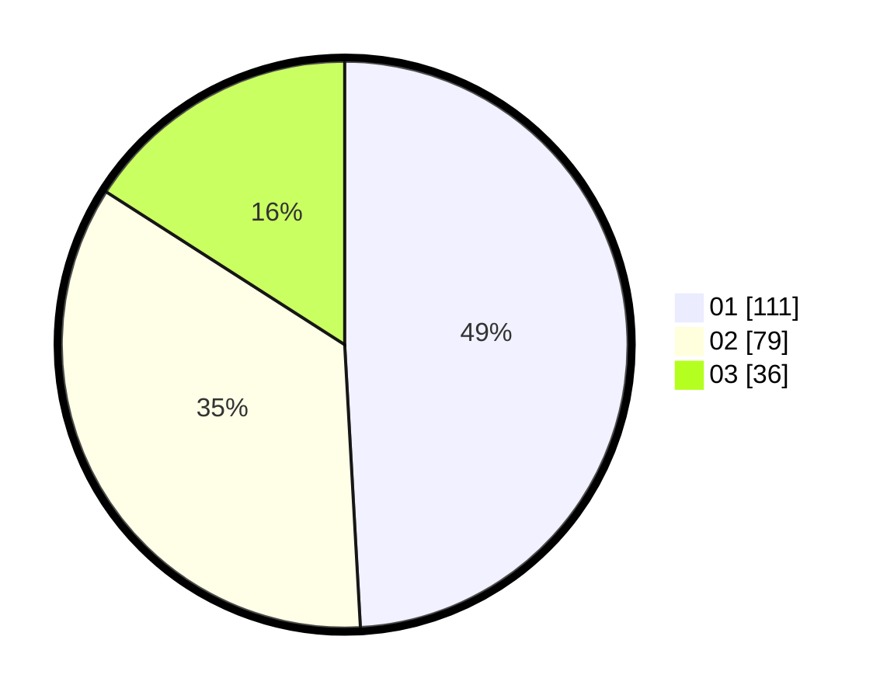

# Hasil

Hasil perolehan suara paslon dapat dilihat pada file paslon-01.txt, paslon-02.txt, dan paslon-03.txt.

Jika tidak ada, artinya data tersebut belum ada pada SIREKAP.

## Perolehan Suara

 * Paslon 01: **111**.
 * Paslon 02: **79**.
 * Paslon 03: **36**.

## Foto C Plano

https://sirekap-obj-formc.kpu.go.id/5754/pemilu/ppwp/31/71/06/10/05/3171061005016-20240214-192737--d8c28e9a-e6a8-4037-a910-9f84eb4c1e1d.jpg

https://sirekap-obj-formc.kpu.go.id/5754/pemilu/ppwp/31/71/06/10/05/3171061005016-20240214-192536--47147e52-1b10-4328-8036-c4bf73ed94c7.jpg

https://sirekap-obj-formc.kpu.go.id/5754/pemilu/ppwp/31/71/06/10/05/3171061005016-20240214-192724--917530b8-5a5e-4c8d-8dbb-0541fc994bb1.jpg

## DATA PEMILIH TETAP

Jumlah pemilih dalam DPT: **275**.
 * L: **133**.
 * P: **142**.

## DATA PENGGUNA HAK PILIH

Jumlah pengguna hak pilih dalam DPT: **206**.
 * L: **103**.
 * P: **103**.

Jumlah pengguna hak pilih dalam DPTb: **19**.
 * L: **9**.
 * P: **10**.

Jumlah pengguna hak pilih dalam DPK: **4**.
 * L: **2**.
 * P: **2**.

Jumlah pengguna hak pilih: **229**.
 * L: **114**.
 * P: **115**.

## JUMLAH SUARA SAH DAN TIDAK SAH

JUMLAH SELURUH SUARA SAH: **226**.

JUMLAH SUARA TIDAK SAH: **3**.

JUMLAH SELURUH SUARA SAH DAN SUARA TIDAK SAH: **229**.
