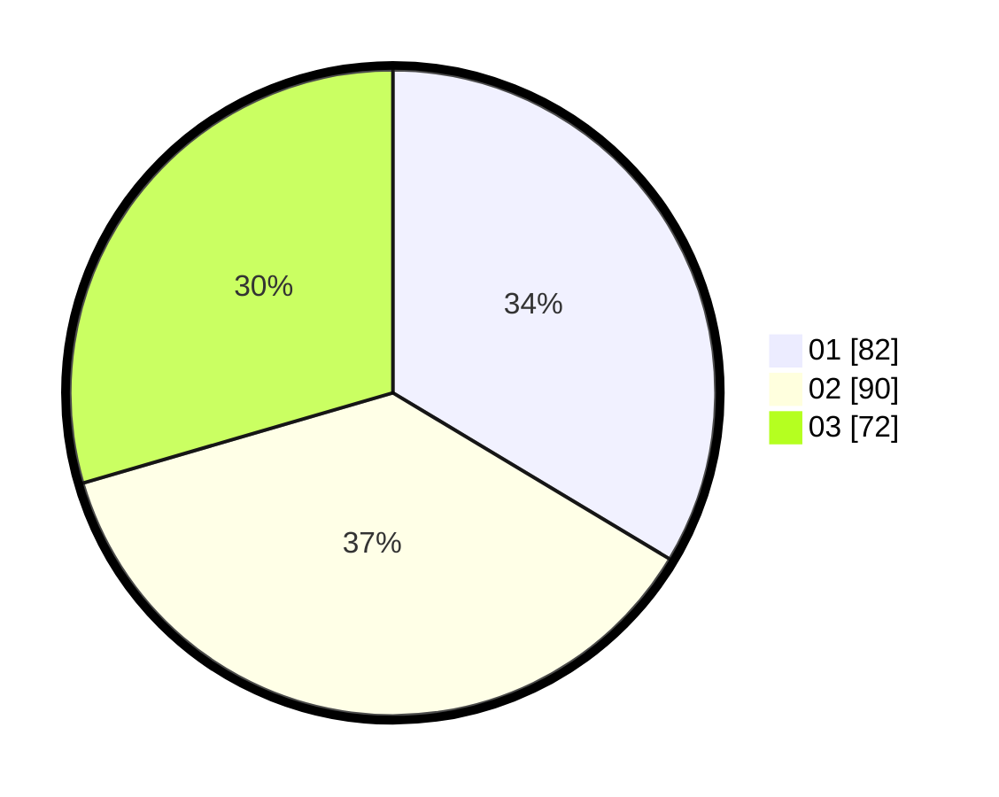

# Hasil

Hasil perolehan suara paslon dapat dilihat pada file paslon-01.txt, paslon-02.txt, dan paslon-03.txt.

Jika tidak ada, artinya data tersebut belum ada pada SIREKAP.

## Perolehan Suara

 * Paslon 01: **82**.
 * Paslon 02: **90**.
 * Paslon 03: **72**.

## Foto C Plano

https://sirekap-obj-formc.kpu.go.id/99f0/pemilu/ppwp/31/71/06/10/05/3171061005019-20240214-193716--35e66afc-392b-47f2-b2b5-95ffda81c1f7.jpg

https://sirekap-obj-formc.kpu.go.id/99f0/pemilu/ppwp/31/71/06/10/05/3171061005019-20240214-193722--70a3f5ab-756e-4f89-b40a-1ed5bf6e2a02.jpg

https://sirekap-obj-formc.kpu.go.id/99f0/pemilu/ppwp/31/71/06/10/05/3171061005019-20240214-193726--213bb832-992c-4a03-91b4-fc58550bf33c.jpg

## DATA PEMILIH TETAP

Jumlah pemilih dalam DPT: **227**.
 * L: **110**.
 * P: **117**.

## DATA PENGGUNA HAK PILIH

Jumlah pengguna hak pilih dalam DPT: **227**.
 * L: **110**.
 * P: **117**.

Jumlah pengguna hak pilih dalam DPTb: **19**.
 * L: **12**.
 * P: **7**.

Jumlah pengguna hak pilih dalam DPK: **4**.
 * L: **2**.
 * P: **2**.

Jumlah pengguna hak pilih: **250**.
 * L: **124**.
 * P: **126**.

## JUMLAH SUARA SAH DAN TIDAK SAH

JUMLAH SELURUH SUARA SAH: **244**.

JUMLAH SUARA TIDAK SAH: **6**.

JUMLAH SELURUH SUARA SAH DAN SUARA TIDAK SAH: **250**.
