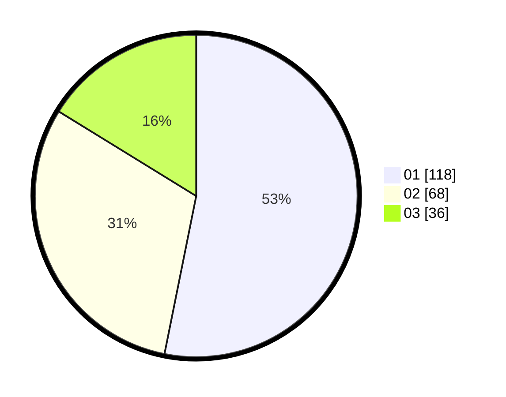

# Hasil

Hasil perolehan suara paslon dapat dilihat pada file paslon-01.txt, paslon-02.txt, dan paslon-03.txt.

Jika tidak ada, artinya data tersebut belum ada pada SIREKAP.

## Perolehan Suara

 * Paslon 01: **118**.
 * Paslon 02: **68**.
 * Paslon 03: **36**.

## Foto C Plano

https://sirekap-obj-formc.kpu.go.id/493b/pemilu/ppwp/31/71/06/10/05/3171061005020-20240214-213409--3047ae96-cd20-4268-8a7d-de6b13d6bcb0.jpg

https://sirekap-obj-formc.kpu.go.id/493b/pemilu/ppwp/31/71/06/10/05/3171061005020-20240218-223316--258635ac-0d4f-41ca-88e2-801da71389ca.jpg

https://sirekap-obj-formc.kpu.go.id/493b/pemilu/ppwp/31/71/06/10/05/3171061005020-20240214-203411--578cda21-c060-450f-a019-02f78577ce06.jpg

## DATA PEMILIH TETAP

Jumlah pemilih dalam DPT: **292**.
 * L: **161**.
 * P: **131**.

## DATA PENGGUNA HAK PILIH

Jumlah pengguna hak pilih dalam DPT: **206**.
 * L: **110**.
 * P: **96**.

Jumlah pengguna hak pilih dalam DPTb: **18**.
 * L: **3**.
 * P: **15**.

Jumlah pengguna hak pilih dalam DPK: **1**.
 * L: **1**.
 * P: **0**.

Jumlah pengguna hak pilih: **225**.
 * L: **114**.
 * P: **111**.

## JUMLAH SUARA SAH DAN TIDAK SAH

JUMLAH SELURUH SUARA SAH: **222**.

JUMLAH SUARA TIDAK SAH: **3**.

JUMLAH SELURUH SUARA SAH DAN SUARA TIDAK SAH: **225**.
