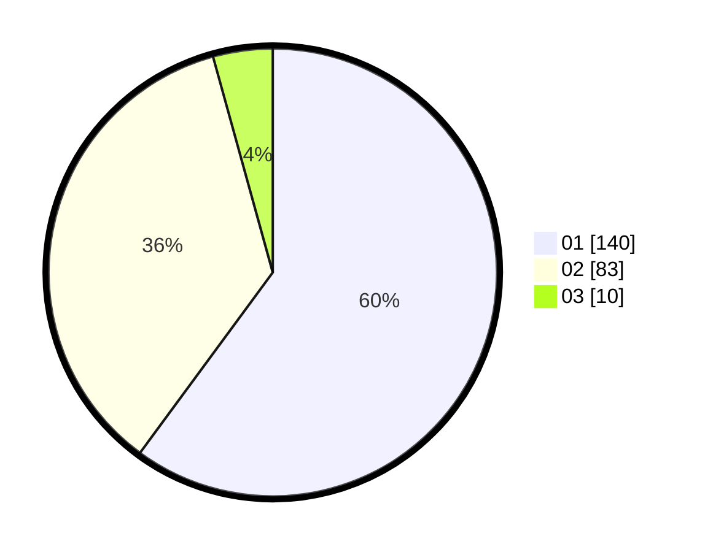

# Hasil

Hasil perolehan suara paslon dapat dilihat pada file paslon-01.txt, paslon-02.txt, dan paslon-03.txt.

Jika tidak ada, artinya data tersebut belum ada pada SIREKAP.

## Perolehan Suara

 * Paslon 01: **140**.
 * Paslon 02: **83**.
 * Paslon 03: **10**.

## Foto C Plano

https://sirekap-obj-formc.kpu.go.id/73a6/pemilu/ppwp/31/71/06/10/05/3171061005021-20240216-193554--c57d46ee-4962-4b01-bb9a-c33090d3e44a.jpg

https://sirekap-obj-formc.kpu.go.id/73a6/pemilu/ppwp/31/71/06/10/05/3171061005021-20240216-194145--419897ae-fed3-455e-95d7-4d20565c9f47.jpg

https://sirekap-obj-formc.kpu.go.id/73a6/pemilu/ppwp/31/71/06/10/05/3171061005021-20240216-194304--a586b30b-1758-4da8-b312-914f4d89d03a.jpg

## DATA PEMILIH TETAP

Jumlah pemilih dalam DPT: **266**.
 * L: **136**.
 * P: **130**.

## DATA PENGGUNA HAK PILIH

Jumlah pengguna hak pilih dalam DPT: **215**.
 * L: **112**.
 * P: **103**.

Jumlah pengguna hak pilih dalam DPTb: **14**.
 * L: **7**.
 * P: **7**.

Jumlah pengguna hak pilih dalam DPK: **5**.
 * L: **2**.
 * P: **3**.

Jumlah pengguna hak pilih: **234**.
 * L: **121**.
 * P: **113**.

## JUMLAH SUARA SAH DAN TIDAK SAH

JUMLAH SELURUH SUARA SAH: **233**.

JUMLAH SUARA TIDAK SAH: **1**.

JUMLAH SELURUH SUARA SAH DAN SUARA TIDAK SAH: **234**.
