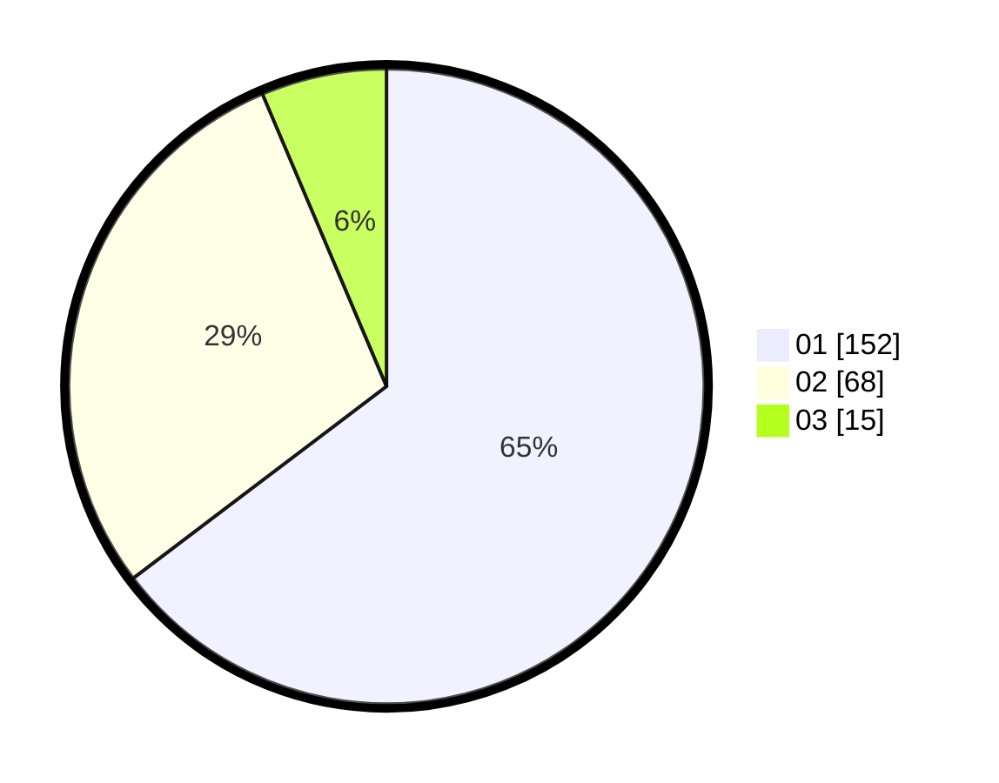

# Hasil

Hasil perolehan suara paslon dapat dilihat pada file paslon-01.txt, paslon-02.txt, dan paslon-03.txt.

Jika tidak ada, artinya data tersebut belum ada pada SIREKAP.

## Perolehan Suara

 * Paslon 01: **152**.
 * Paslon 02: **68**.
 * Paslon 03: **15**.

## Foto C Plano

https://sirekap-obj-formc.kpu.go.id/63e6/pemilu/ppwp/31/71/06/10/05/3171061005022-20240214-233205--c70e2c59-4039-439e-8865-26df8a89e981.jpg

https://sirekap-obj-formc.kpu.go.id/63e6/pemilu/ppwp/31/71/06/10/05/3171061005022-20240217-213329--37f177a8-305b-4b51-9c04-4b140e2bbca4.jpg

https://sirekap-obj-formc.kpu.go.id/63e6/pemilu/ppwp/31/71/06/10/05/3171061005022-20240217-201152--4e265f6c-c6f1-4b84-8ec1-0ce216997aed.jpg

## DATA PEMILIH TETAP

Jumlah pemilih dalam DPT: **275**.
 * L: **143**.
 * P: **132**.

## DATA PENGGUNA HAK PILIH

Jumlah pengguna hak pilih dalam DPT: **219**.
 * L: **111**.
 * P: **108**.

Jumlah pengguna hak pilih dalam DPTb: **14**.
 * L: **7**.
 * P: **7**.

Jumlah pengguna hak pilih dalam DPK: **4**.
 * L: **4**.
 * P: **0**.

Jumlah pengguna hak pilih: **237**.
 * L: **122**.
 * P: **115**.

## JUMLAH SUARA SAH DAN TIDAK SAH

JUMLAH SELURUH SUARA SAH: **235**.

JUMLAH SUARA TIDAK SAH: **2**.

JUMLAH SELURUH SUARA SAH DAN SUARA TIDAK SAH: **237**.
