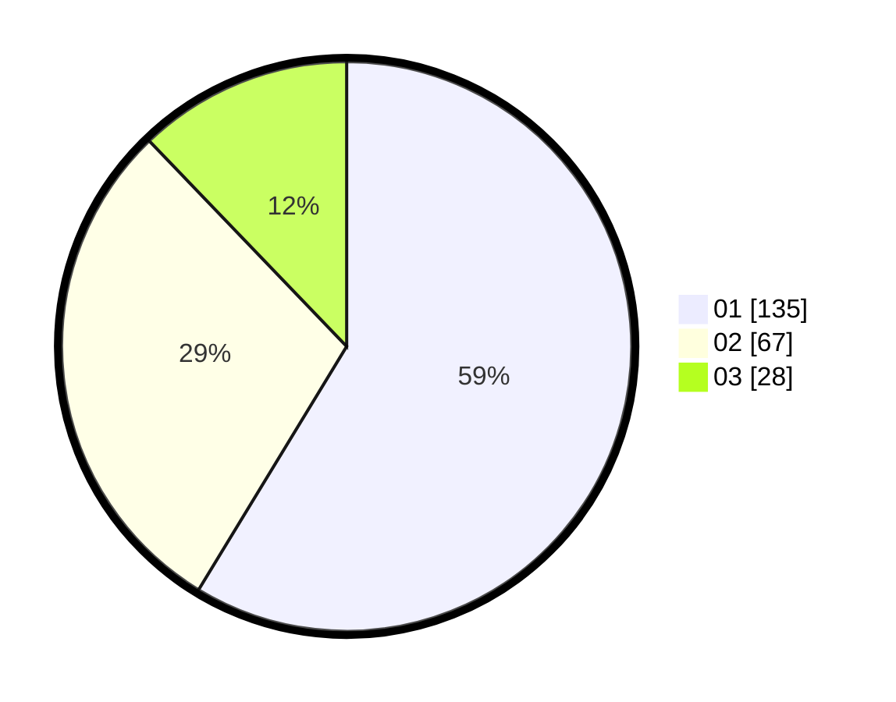

# Hasil

Hasil perolehan suara paslon dapat dilihat pada file paslon-01.txt, paslon-02.txt, dan paslon-03.txt.

Jika tidak ada, artinya data tersebut belum ada pada SIREKAP.

## Perolehan Suara

 * Paslon 01: **135**.
 * Paslon 02: **67**.
 * Paslon 03: **28**.

## Foto C Plano

https://sirekap-obj-formc.kpu.go.id/2be0/pemilu/ppwp/31/71/06/10/05/3171061005024-20240218-122024--3954230d-0190-4156-b7af-8b62f11ba307.jpg

https://sirekap-obj-formc.kpu.go.id/2be0/pemilu/ppwp/31/71/06/10/05/3171061005024-20240215-005904--62084670-ad00-4b19-a3a4-52a3d74e70c2.jpg

https://sirekap-obj-formc.kpu.go.id/2be0/pemilu/ppwp/31/71/06/10/05/3171061005024-20240215-010005--5ee8966f-3944-4b35-bd00-21a47e229781.jpg
