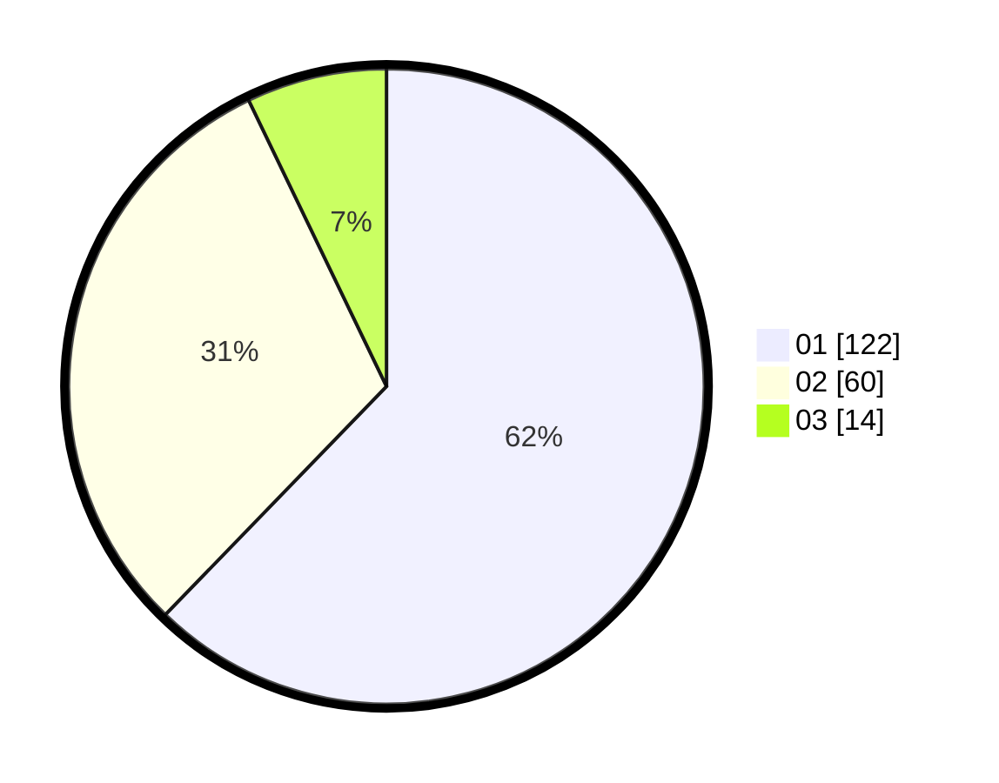

# Hasil

Hasil perolehan suara paslon dapat dilihat pada file paslon-01.txt, paslon-02.txt, dan paslon-03.txt.

Jika tidak ada, artinya data tersebut belum ada pada SIREKAP.

## Perolehan Suara

 * Paslon 01: **122**.
 * Paslon 02: **60**.
 * Paslon 03: **14**.

## Foto C Plano

https://sirekap-obj-formc.kpu.go.id/6095/pemilu/ppwp/31/71/06/10/05/3171061005025-20240215-012206--9550a54f-6b00-455f-b10a-102b4904c25e.jpg

https://sirekap-obj-formc.kpu.go.id/6095/pemilu/ppwp/31/71/06/10/05/3171061005025-20240215-012255--1e299260-70b3-4410-a1f2-d1d1d73c4ff4.jpg
