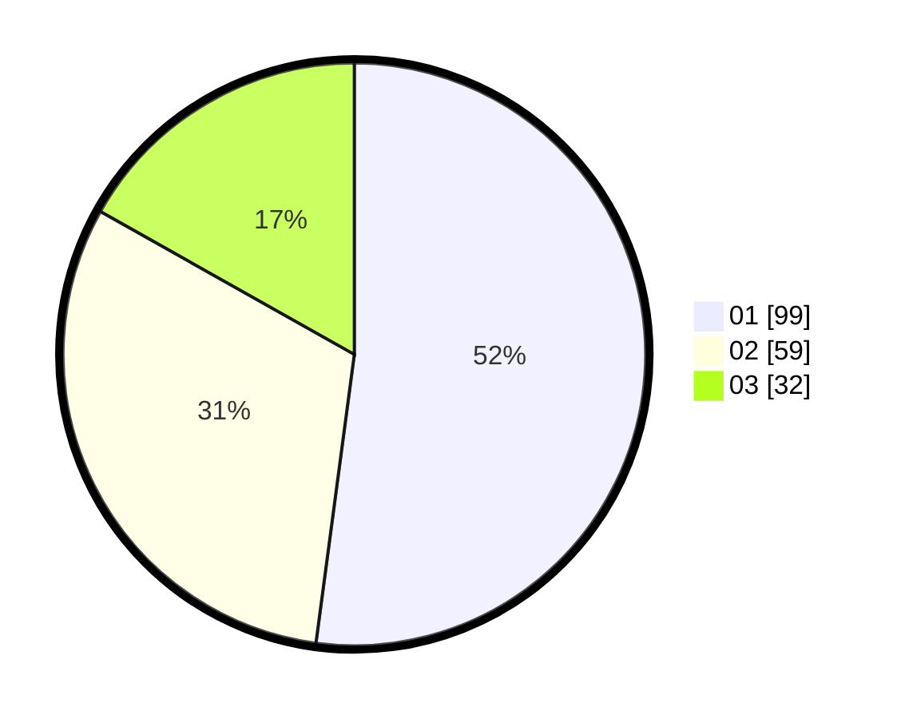

# Hasil

Hasil perolehan suara paslon dapat dilihat pada file paslon-01.txt, paslon-02.txt, dan paslon-03.txt.

Jika tidak ada, artinya data tersebut belum ada pada SIREKAP.

## Perolehan Suara

 * Paslon 01: **99**.
 * Paslon 02: **59**.
 * Paslon 03: **32**.

## Foto C Plano

https://sirekap-obj-formc.kpu.go.id/ff49/pemilu/ppwp/31/71/06/10/05/3171061005028-20240218-014339--6339a72f-b890-465e-94e2-cc1530701ce4.jpg

https://sirekap-obj-formc.kpu.go.id/ff49/pemilu/ppwp/31/71/06/10/05/3171061005028-20240218-014735--a5632889-5088-4375-88a5-7cf595a24b12.jpg

https://sirekap-obj-formc.kpu.go.id/ff49/pemilu/ppwp/31/71/06/10/05/3171061005028-20240218-014930--6ac83102-dad4-4150-9dcc-fd7ffaeb459a.jpg

## DATA PEMILIH TETAP

Jumlah pemilih dalam DPT: **254**.
 * L: **134**.
 * P: **120**.

## DATA PENGGUNA HAK PILIH

Jumlah pengguna hak pilih dalam DPT: **183**.
 * L: **99**.
 * P: **84**.

Jumlah pengguna hak pilih dalam DPTb: **3**.
 * L: **1**.
 * P: **2**.

Jumlah pengguna hak pilih dalam DPK: **9**.
 * L: **4**.
 * P: **5**.

Jumlah pengguna hak pilih: **195**.
 * L: **104**.
 * P: **91**.

## JUMLAH SUARA SAH DAN TIDAK SAH

JUMLAH SELURUH SUARA SAH: **190**.

JUMLAH SUARA TIDAK SAH: **5**.

JUMLAH SELURUH SUARA SAH DAN SUARA TIDAK SAH: **195**.
