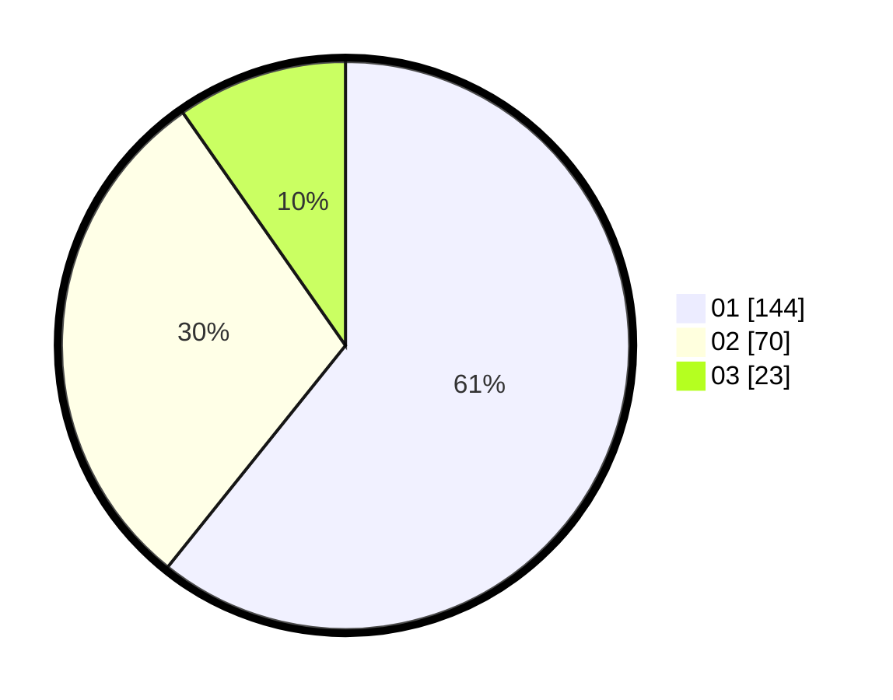

# Hasil

Hasil perolehan suara paslon dapat dilihat pada file paslon-01.txt, paslon-02.txt, dan paslon-03.txt.

Jika tidak ada, artinya data tersebut belum ada pada SIREKAP.

## Perolehan Suara

 * Paslon 01: **144**.
 * Paslon 02: **70**.
 * Paslon 03: **23**.

## Foto C Plano

https://sirekap-obj-formc.kpu.go.id/1731/pemilu/ppwp/31/71/06/10/05/3171061005029-20240217-231852--950f0e7c-aa72-41a7-aef4-dfab97e753bf.jpg

https://sirekap-obj-formc.kpu.go.id/1731/pemilu/ppwp/31/71/06/10/05/3171061005029-20240217-232244--a128afea-2cae-4491-8a72-a001671be66c.jpg

https://sirekap-obj-formc.kpu.go.id/1731/pemilu/ppwp/31/71/06/10/05/3171061005029-20240217-232617--12c632f8-4ed9-419f-bbd1-db410f8ee504.jpg

## DATA PEMILIH TETAP

Jumlah pemilih dalam DPT: **283**.
 * L: **155**.
 * P: **128**.

## DATA PENGGUNA HAK PILIH

Jumlah pengguna hak pilih dalam DPT: **216**.
 * L: **121**.
 * P: **95**.

Jumlah pengguna hak pilih dalam DPTb: **22**.
 * L: **6**.
 * P: **16**.

Jumlah pengguna hak pilih dalam DPK: **1**.
 * L: **0**.
 * P: **1**.

Jumlah pengguna hak pilih: **239**.
 * L: **127**.
 * P: **112**.

## JUMLAH SUARA SAH DAN TIDAK SAH

JUMLAH SELURUH SUARA SAH: **237**.

JUMLAH SUARA TIDAK SAH: **2**.

JUMLAH SELURUH SUARA SAH DAN SUARA TIDAK SAH: **239**.
