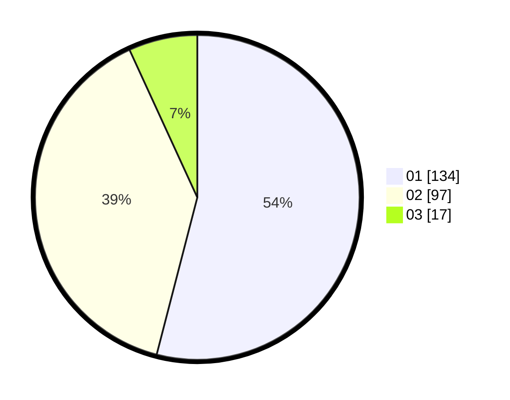

# Hasil

Hasil perolehan suara paslon dapat dilihat pada file paslon-01.txt, paslon-02.txt, dan paslon-03.txt.

Jika tidak ada, artinya data tersebut belum ada pada SIREKAP.

## Perolehan Suara

 * Paslon 01: **134**.
 * Paslon 02: **97**.
 * Paslon 03: **17**.

## Foto C Plano

https://sirekap-obj-formc.kpu.go.id/4abc/pemilu/ppwp/31/71/06/10/05/3171061005033-20240214-212143--56f9e535-c0cc-4b89-bf4f-fea7203985e8.jpg

https://sirekap-obj-formc.kpu.go.id/4abc/pemilu/ppwp/31/71/06/10/05/3171061005033-20240214-205944--551f2f4e-1df0-40a8-91a1-160a5ba1821f.jpg

https://sirekap-obj-formc.kpu.go.id/4abc/pemilu/ppwp/31/71/06/10/05/3171061005033-20240214-210132--f7894249-3d2d-4dea-b203-3acb3979672e.jpg

## DATA PEMILIH TETAP

Jumlah pemilih dalam DPT: **278**.
 * L: **144**.
 * P: **134**.

## DATA PENGGUNA HAK PILIH

Jumlah pengguna hak pilih dalam DPT: **233**.
 * L: **119**.
 * P: **114**.

Jumlah pengguna hak pilih dalam DPTb: **16**.
 * L: **4**.
 * P: **12**.

Jumlah pengguna hak pilih dalam DPK: **3**.
 * L: **1**.
 * P: **2**.

Jumlah pengguna hak pilih: **252**.
 * L: **124**.
 * P: **128**.

## JUMLAH SUARA SAH DAN TIDAK SAH

JUMLAH SELURUH SUARA SAH: **248**.

JUMLAH SUARA TIDAK SAH: **4**.

JUMLAH SELURUH SUARA SAH DAN SUARA TIDAK SAH: **252**.
