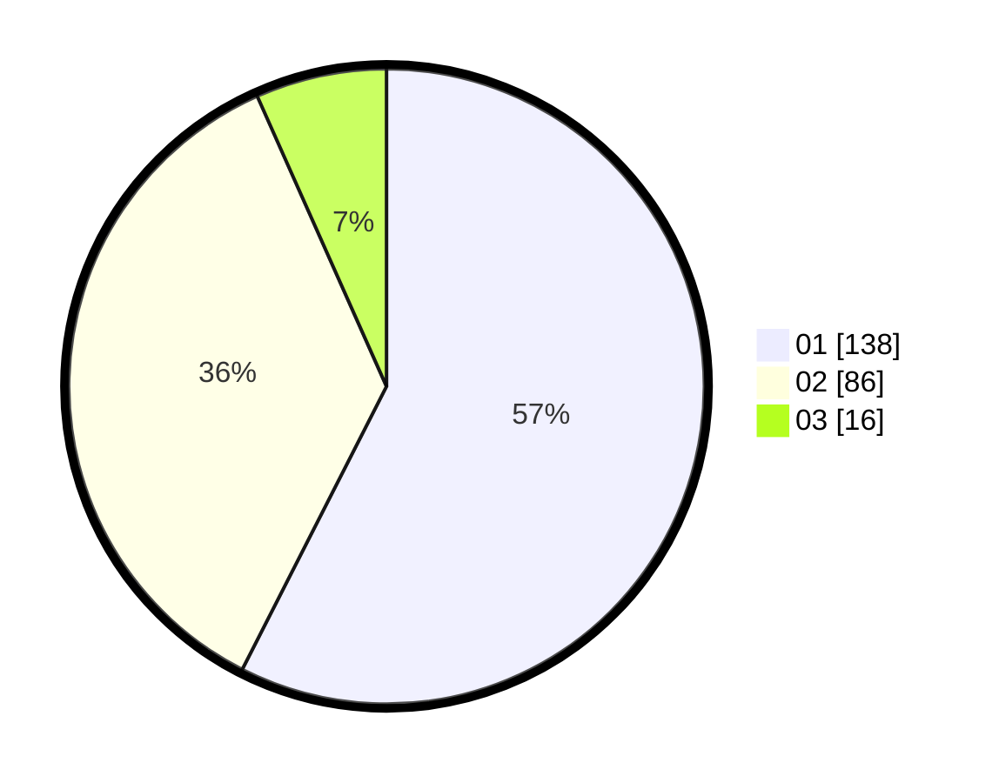

# Hasil

Hasil perolehan suara paslon dapat dilihat pada file paslon-01.txt, paslon-02.txt, dan paslon-03.txt.

Jika tidak ada, artinya data tersebut belum ada pada SIREKAP.

## Perolehan Suara

 * Paslon 01: **138**.
 * Paslon 02: **86**.
 * Paslon 03: **16**.

## Foto C Plano

https://sirekap-obj-formc.kpu.go.id/0ab9/pemilu/ppwp/31/71/06/10/05/3171061005035-20240214-202126--3176696b-c77f-45ba-9cfc-7be04b9f78b2.jpg

https://sirekap-obj-formc.kpu.go.id/0ab9/pemilu/ppwp/31/71/06/10/05/3171061005035-20240214-202523--a08b2902-ae9a-48e2-89a5-f6f3db6da4d8.jpg

https://sirekap-obj-formc.kpu.go.id/0ab9/pemilu/ppwp/31/71/06/10/05/3171061005035-20240214-194523--3518f34d-9d1a-4c72-98b3-29f33a07ad5c.jpg

## DATA PEMILIH TETAP

Jumlah pemilih dalam DPT: **277**.
 * L: **138**.
 * P: **139**.

## DATA PENGGUNA HAK PILIH

Jumlah pengguna hak pilih dalam DPT: **223**.
 * L: **106**.
 * P: **116**.

Jumlah pengguna hak pilih dalam DPTb: **20**.
 * L: **8**.
 * P: **12**.

Jumlah pengguna hak pilih dalam DPK: **0**.
 * L: **0**.
 * P: **0**.

Jumlah pengguna hak pilih: **243**.
 * L: **114**.
 * P: **128**.

## JUMLAH SUARA SAH DAN TIDAK SAH

JUMLAH SELURUH SUARA SAH: **240**.

JUMLAH SUARA TIDAK SAH: **2**.

JUMLAH SELURUH SUARA SAH DAN SUARA TIDAK SAH: **242**.
