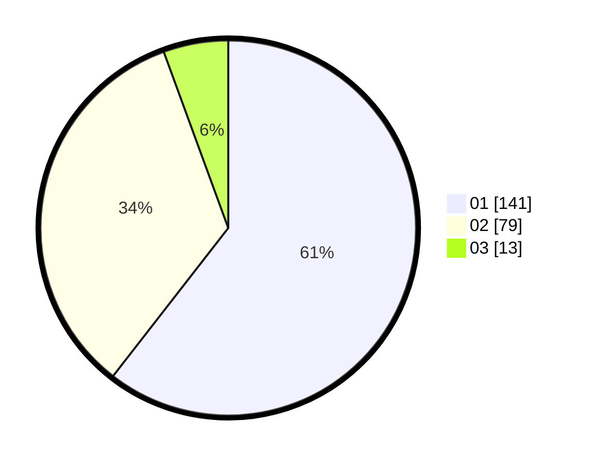

# Hasil

Hasil perolehan suara paslon dapat dilihat pada file paslon-01.txt, paslon-02.txt, dan paslon-03.txt.

Jika tidak ada, artinya data tersebut belum ada pada SIREKAP.

## Perolehan Suara

 * Paslon 01: **141**.
 * Paslon 02: **79**.
 * Paslon 03: **13**.

## Foto C Plano

https://sirekap-obj-formc.kpu.go.id/7865/pemilu/ppwp/31/71/06/10/05/3171061005037-20240216-212715--f21517bd-31c9-4fe9-b2cf-918f650374f7.jpg

https://sirekap-obj-formc.kpu.go.id/7865/pemilu/ppwp/31/71/06/10/05/3171061005037-20240216-212716--b17239bf-7dec-4b4f-bd52-746ae51521b2.jpg

https://sirekap-obj-formc.kpu.go.id/7865/pemilu/ppwp/31/71/06/10/05/3171061005037-20240216-212715--7024e4a1-40e4-43e0-979e-f0a6a31208b6.jpg

## DATA PEMILIH TETAP

Jumlah pemilih dalam DPT: **276**.
 * L: **133**.
 * P: **143**.

## DATA PENGGUNA HAK PILIH

Jumlah pengguna hak pilih dalam DPT: **220**.
 * L: **107**.
 * P: **113**.

Jumlah pengguna hak pilih dalam DPTb: **14**.
 * L: **6**.
 * P: **8**.

Jumlah pengguna hak pilih dalam DPK: **6**.
 * L: **3**.
 * P: **3**.

Jumlah pengguna hak pilih: **240**.
 * L: **116**.
 * P: **124**.

## JUMLAH SUARA SAH DAN TIDAK SAH

JUMLAH SELURUH SUARA SAH: **233**.

JUMLAH SUARA TIDAK SAH: **7**.

JUMLAH SELURUH SUARA SAH DAN SUARA TIDAK SAH: **240**.
