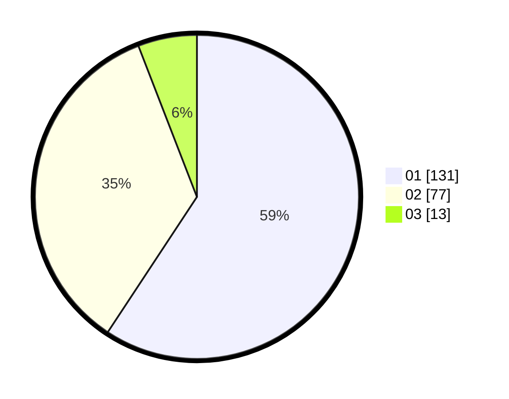

# Hasil

Hasil perolehan suara paslon dapat dilihat pada file paslon-01.txt, paslon-02.txt, dan paslon-03.txt.

Jika tidak ada, artinya data tersebut belum ada pada SIREKAP.

## Perolehan Suara

 * Paslon 01: **131**.
 * Paslon 02: **77**.
 * Paslon 03: **13**.

## Foto C Plano

https://sirekap-obj-formc.kpu.go.id/77c8/pemilu/ppwp/31/71/06/10/05/3171061005038-20240214-230458--08065bb2-9f3b-4f23-a40b-4f25ab6fe2e3.jpg

https://sirekap-obj-formc.kpu.go.id/77c8/pemilu/ppwp/31/71/06/10/05/3171061005038-20240214-230654--5660c7a6-04ca-4ec1-ae00-ea42b9d3a996.jpg

https://sirekap-obj-formc.kpu.go.id/77c8/pemilu/ppwp/31/71/06/10/05/3171061005038-20240214-210010--8e86b2b3-763a-490d-bef5-4bca30636c5d.jpg

## DATA PEMILIH TETAP

Jumlah pemilih dalam DPT: **279**.
 * L: **139**.
 * P: **140**.

## DATA PENGGUNA HAK PILIH

Jumlah pengguna hak pilih dalam DPT: **215**.
 * L: **105**.
 * P: **110**.

Jumlah pengguna hak pilih dalam DPTb: **10**.
 * L: **3**.
 * P: **7**.

Jumlah pengguna hak pilih dalam DPK: **2**.
 * L: **1**.
 * P: **1**.

Jumlah pengguna hak pilih: **227**.
 * L: **109**.
 * P: **118**.

## JUMLAH SUARA SAH DAN TIDAK SAH

JUMLAH SELURUH SUARA SAH: **221**.

JUMLAH SUARA TIDAK SAH: **6**.

JUMLAH SELURUH SUARA SAH DAN SUARA TIDAK SAH: **227**.
