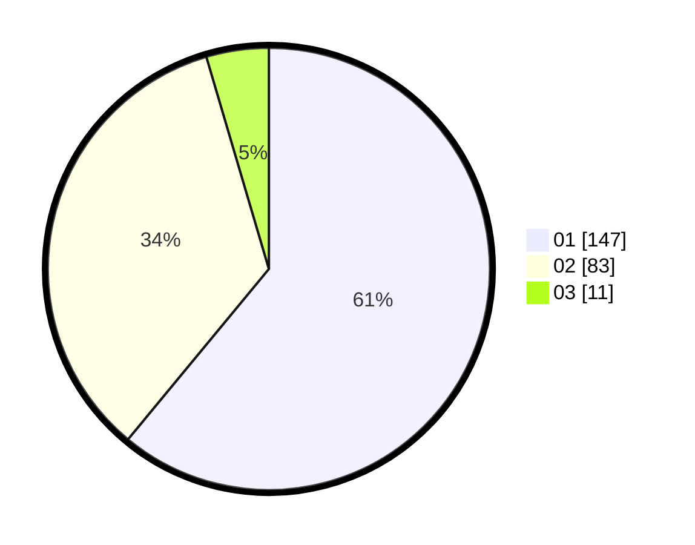

# Hasil

Hasil perolehan suara paslon dapat dilihat pada file paslon-01.txt, paslon-02.txt, dan paslon-03.txt.

Jika tidak ada, artinya data tersebut belum ada pada SIREKAP.

## Perolehan Suara

 * Paslon 01: **147**.
 * Paslon 02: **83**.
 * Paslon 03: **11**.

## Foto C Plano

https://sirekap-obj-formc.kpu.go.id/29b3/pemilu/ppwp/31/71/06/10/05/3171061005040-20240216-140442--8c2bf926-0414-4274-b985-6f7eab55c6d4.jpg

https://sirekap-obj-formc.kpu.go.id/29b3/pemilu/ppwp/31/71/06/10/05/3171061005040-20240216-140444--32b522f9-d282-4000-ba37-ab99ded1f182.jpg

https://sirekap-obj-formc.kpu.go.id/29b3/pemilu/ppwp/31/71/06/10/05/3171061005040-20240216-140443--bbfd9001-25b2-4114-9d8e-fa97bff9f1a1.jpg

## DATA PEMILIH TETAP

Jumlah pemilih dalam DPT: **0**.
 * L: **0**.
 * P: **0**.

## DATA PENGGUNA HAK PILIH

Jumlah pengguna hak pilih dalam DPT: **0**.
 * L: **0**.
 * P: **0**.

Jumlah pengguna hak pilih dalam DPTb: **0**.
 * L: **0**.
 * P: **0**.

Jumlah pengguna hak pilih dalam DPK: **0**.
 * L: **0**.
 * P: **0**.

Jumlah pengguna hak pilih: **0**.
 * L: **0**.
 * P: **0**.

## JUMLAH SUARA SAH DAN TIDAK SAH

JUMLAH SELURUH SUARA SAH: **241**.

JUMLAH SUARA TIDAK SAH: **5**.

JUMLAH SELURUH SUARA SAH DAN SUARA TIDAK SAH: **246**.
