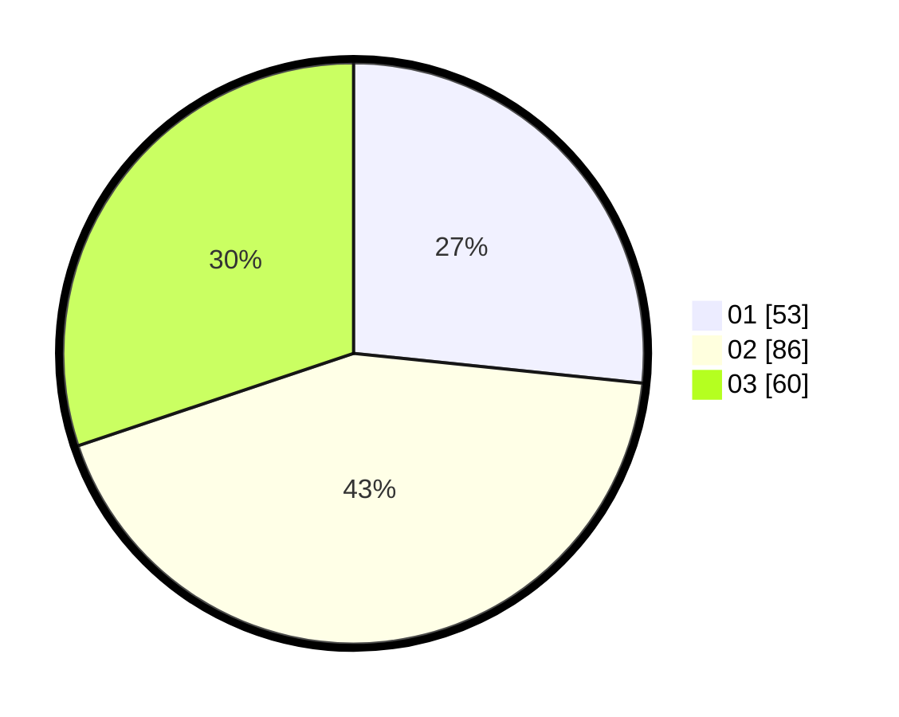

# Hasil

Hasil perolehan suara paslon dapat dilihat pada file paslon-01.txt, paslon-02.txt, dan paslon-03.txt.

Jika tidak ada, artinya data tersebut belum ada pada SIREKAP.

## Perolehan Suara

 * Paslon 01: **53**.
 * Paslon 02: **86**.
 * Paslon 03: **60**.

## Foto C Plano

https://sirekap-obj-formc.kpu.go.id/0966/pemilu/ppwp/31/71/07/10/01/3171071001003-20240214-211546--ea171865-f3d6-4b40-8c29-f3bb0bd72e84.jpg

https://sirekap-obj-formc.kpu.go.id/0966/pemilu/ppwp/31/71/07/10/01/3171071001003-20240214-211554--89e4583a-0175-4b4e-b0c5-265b1f82ad9e.jpg

https://sirekap-obj-formc.kpu.go.id/0966/pemilu/ppwp/31/71/07/10/01/3171071001003-20240214-211558--81fa9905-1a58-4d41-b819-5c3bdce30cf5.jpg

## DATA PEMILIH TETAP

Jumlah pemilih dalam DPT: **257**.
 * L: **142**.
 * P: **125**.

## DATA PENGGUNA HAK PILIH

Jumlah pengguna hak pilih dalam DPT: **180**.
 * L: **91**.
 * P: **89**.

Jumlah pengguna hak pilih dalam DPTb: **21**.
 * L: **10**.
 * P: **11**.

Jumlah pengguna hak pilih dalam DPK: **1**.
 * L: **0**.
 * P: **1**.

Jumlah pengguna hak pilih: **202**.
 * L: **101**.
 * P: **101**.

## JUMLAH SUARA SAH DAN TIDAK SAH

JUMLAH SELURUH SUARA SAH: **199**.

JUMLAH SUARA TIDAK SAH: **3**.

JUMLAH SELURUH SUARA SAH DAN SUARA TIDAK SAH: **202**.
