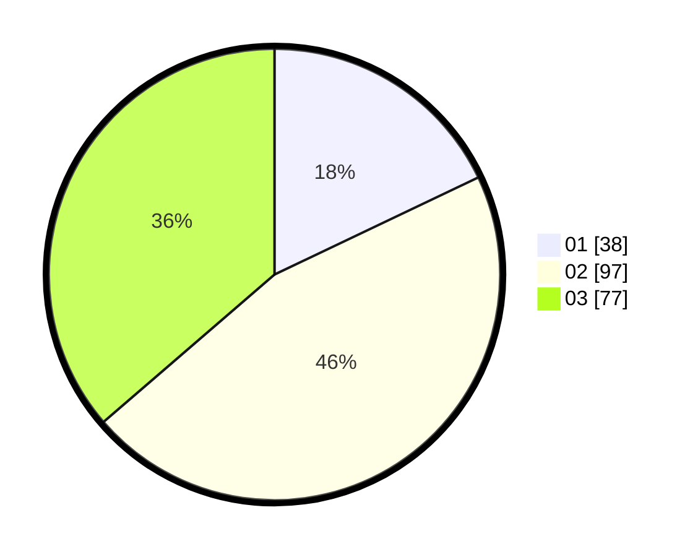

# Hasil

Hasil perolehan suara paslon dapat dilihat pada file paslon-01.txt, paslon-02.txt, dan paslon-03.txt.

Jika tidak ada, artinya data tersebut belum ada pada SIREKAP.

## Perolehan Suara

 * Paslon 01: **38**.
 * Paslon 02: **97**.
 * Paslon 03: **77**.

## Foto C Plano

https://sirekap-obj-formc.kpu.go.id/c891/pemilu/ppwp/31/71/07/10/01/3171071001004-20240215-150545--ae53a2d3-5f9a-4d6e-9083-063a6b7f49cf.jpg

https://sirekap-obj-formc.kpu.go.id/c891/pemilu/ppwp/31/71/07/10/01/3171071001004-20240216-012800--445b14f0-6d78-44ad-9699-87c5f2f6f022.jpg

https://sirekap-obj-formc.kpu.go.id/c891/pemilu/ppwp/31/71/07/10/01/3171071001004-20240216-012759--ffd835ea-6f25-402c-a05e-39b3aa700ea2.jpg

## DATA PEMILIH TETAP

Jumlah pemilih dalam DPT: **244**.
 * L: **115**.
 * P: **129**.

## DATA PENGGUNA HAK PILIH

Jumlah pengguna hak pilih dalam DPT: **191**.
 * L: **102**.
 * P: **89**.

Jumlah pengguna hak pilih dalam DPTb: **23**.
 * L: **11**.
 * P: **12**.

Jumlah pengguna hak pilih dalam DPK: **0**.
 * L: **0**.
 * P: **0**.

Jumlah pengguna hak pilih: **214**.
 * L: **113**.
 * P: **101**.

## JUMLAH SUARA SAH DAN TIDAK SAH

JUMLAH SELURUH SUARA SAH: **212**.

JUMLAH SUARA TIDAK SAH: **2**.

JUMLAH SELURUH SUARA SAH DAN SUARA TIDAK SAH: **214**.
