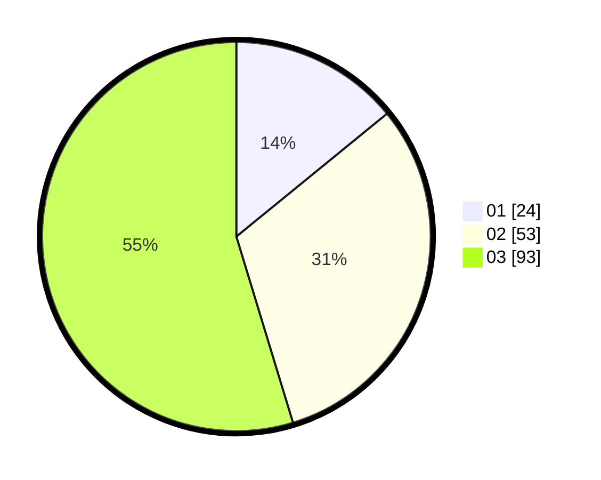

# Hasil

Hasil perolehan suara paslon dapat dilihat pada file paslon-01.txt, paslon-02.txt, dan paslon-03.txt.

Jika tidak ada, artinya data tersebut belum ada pada SIREKAP.

## Perolehan Suara

 * Paslon 01: **24**.
 * Paslon 02: **53**.
 * Paslon 03: **93**.

## Foto C Plano

https://sirekap-obj-formc.kpu.go.id/e034/pemilu/ppwp/31/71/07/10/01/3171071001005-20240214-221911--f7b1a472-77fb-4c58-afbe-bb205285ca89.jpg

https://sirekap-obj-formc.kpu.go.id/e034/pemilu/ppwp/31/71/07/10/01/3171071001005-20240214-222041--5770649f-f863-49e6-bd52-e1a2698702f0.jpg

https://sirekap-obj-formc.kpu.go.id/e034/pemilu/ppwp/31/71/07/10/01/3171071001005-20240214-222136--f44cfd7b-e196-46f8-9287-981d46a15386.jpg

## DATA PEMILIH TETAP

Jumlah pemilih dalam DPT: **211**.
 * L: **99**.
 * P: **112**.

## DATA PENGGUNA HAK PILIH

Jumlah pengguna hak pilih dalam DPT: **150**.
 * L: **75**.
 * P: **75**.

Jumlah pengguna hak pilih dalam DPTb: **22**.
 * L: **10**.
 * P: **12**.

Jumlah pengguna hak pilih dalam DPK: **1**.
 * L: **0**.
 * P: **1**.

Jumlah pengguna hak pilih: **173**.
 * L: **85**.
 * P: **88**.

## JUMLAH SUARA SAH DAN TIDAK SAH

JUMLAH SELURUH SUARA SAH: **170**.

JUMLAH SUARA TIDAK SAH: **3**.

JUMLAH SELURUH SUARA SAH DAN SUARA TIDAK SAH: **173**.
