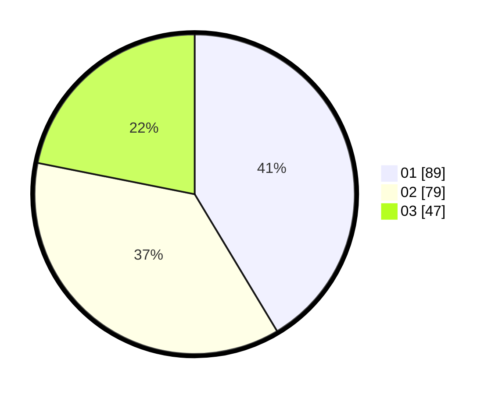

# Hasil

Hasil perolehan suara paslon dapat dilihat pada file paslon-01.txt, paslon-02.txt, dan paslon-03.txt.

Jika tidak ada, artinya data tersebut belum ada pada SIREKAP.

## Perolehan Suara

 * Paslon 01: **89**.
 * Paslon 02: **79**.
 * Paslon 03: **47**.

## Foto C Plano

https://sirekap-obj-formc.kpu.go.id/e141/pemilu/ppwp/31/71/07/10/01/3171071001009-20240215-232434--cb8a888f-b372-4131-8bf8-c06c9f1d2415.jpg

https://sirekap-obj-formc.kpu.go.id/e141/pemilu/ppwp/31/71/07/10/01/3171071001009-20240215-232436--8c11cdb2-b291-4d5a-8ade-c550d85e3816.jpg

https://sirekap-obj-formc.kpu.go.id/e141/pemilu/ppwp/31/71/07/10/01/3171071001009-20240215-232435--543bf0be-33f8-45e4-b797-dab69dc690bf.jpg

## DATA PEMILIH TETAP

Jumlah pemilih dalam DPT: **255**.
 * L: **123**.
 * P: **132**.

## DATA PENGGUNA HAK PILIH

Jumlah pengguna hak pilih dalam DPT: **180**.
 * L: **89**.
 * P: **91**.

Jumlah pengguna hak pilih dalam DPTb: **38**.
 * L: **18**.
 * P: **20**.

Jumlah pengguna hak pilih dalam DPK: **2**.
 * L: **1**.
 * P: **1**.

Jumlah pengguna hak pilih: **220**.
 * L: **108**.
 * P: **112**.

## JUMLAH SUARA SAH DAN TIDAK SAH

JUMLAH SELURUH SUARA SAH: **215**.

JUMLAH SUARA TIDAK SAH: **5**.

JUMLAH SELURUH SUARA SAH DAN SUARA TIDAK SAH: **220**.
