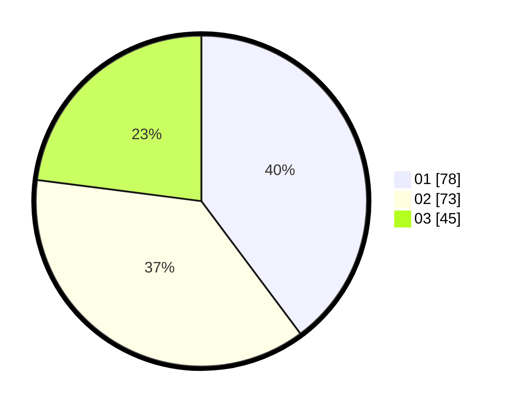

# Hasil

Hasil perolehan suara paslon dapat dilihat pada file paslon-01.txt, paslon-02.txt, dan paslon-03.txt.

Jika tidak ada, artinya data tersebut belum ada pada SIREKAP.

## Perolehan Suara

 * Paslon 01: **78**.
 * Paslon 02: **73**.
 * Paslon 03: **45**.

## Foto C Plano

https://sirekap-obj-formc.kpu.go.id/0083/pemilu/ppwp/31/71/07/10/01/3171071001011-20240215-224105--748f36ab-0d48-4c13-8ba8-18842f5cd7fa.jpg

https://sirekap-obj-formc.kpu.go.id/0083/pemilu/ppwp/31/71/07/10/01/3171071001011-20240215-224109--3855fc52-d954-45b0-9d10-a7c914d79123.jpg

https://sirekap-obj-formc.kpu.go.id/0083/pemilu/ppwp/31/71/07/10/01/3171071001011-20240215-224107--15d51091-e837-47a7-9b66-4b6e3a554551.jpg

## DATA PEMILIH TETAP

Jumlah pemilih dalam DPT: **243**.
 * L: **115**.
 * P: **128**.

## DATA PENGGUNA HAK PILIH

Jumlah pengguna hak pilih dalam DPT: **190**.
 * L: **84**.
 * P: **106**.

Jumlah pengguna hak pilih dalam DPTb: **9**.
 * L: **2**.
 * P: **7**.

Jumlah pengguna hak pilih dalam DPK: **2**.
 * L: **1**.
 * P: **1**.

Jumlah pengguna hak pilih: **201**.
 * L: **87**.
 * P: **114**.

## JUMLAH SUARA SAH DAN TIDAK SAH

JUMLAH SELURUH SUARA SAH: **196**.

JUMLAH SUARA TIDAK SAH: **5**.

JUMLAH SELURUH SUARA SAH DAN SUARA TIDAK SAH: **201**.
