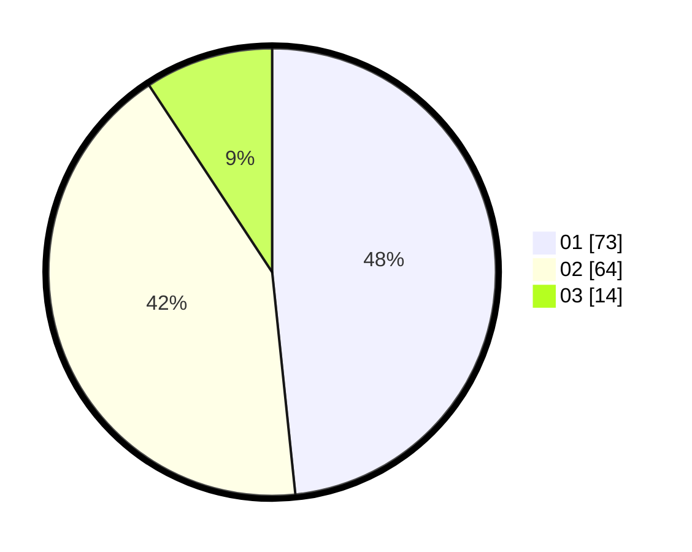

# Hasil

Hasil perolehan suara paslon dapat dilihat pada file paslon-01.txt, paslon-02.txt, dan paslon-03.txt.

Jika tidak ada, artinya data tersebut belum ada pada SIREKAP.

## Perolehan Suara

 * Paslon 01: **73**.
 * Paslon 02: **64**.
 * Paslon 03: **14**.

## Foto C Plano

https://sirekap-obj-formc.kpu.go.id/9d60/pemilu/ppwp/31/71/07/10/02/3171071002006-20240214-224859--7e09259a-e8f2-44c9-88d3-6cacffc07ede.jpg

https://sirekap-obj-formc.kpu.go.id/9d60/pemilu/ppwp/31/71/07/10/02/3171071002006-20240214-225135--b71fab37-6cae-4920-a620-10db7e22c65c.jpg

https://sirekap-obj-formc.kpu.go.id/9d60/pemilu/ppwp/31/71/07/10/02/3171071002006-20240214-225300--18c0a3ca-657d-41a5-9fd8-a65e62ea2a66.jpg

## DATA PEMILIH TETAP

Jumlah pemilih dalam DPT: **151**.
 * L: **60**.
 * P: **91**.

## DATA PENGGUNA HAK PILIH

Jumlah pengguna hak pilih dalam DPT: **127**.
 * L: **0**.
 * P: **0**.

Jumlah pengguna hak pilih dalam DPTb: **20**.
 * L: **0**.
 * P: **0**.

Jumlah pengguna hak pilih dalam DPK: **4**.
 * L: **0**.
 * P: **0**.

Jumlah pengguna hak pilih: **151**.
 * L: **0**.
 * P: **0**.

## JUMLAH SUARA SAH DAN TIDAK SAH

JUMLAH SELURUH SUARA SAH: **151**.

JUMLAH SUARA TIDAK SAH: **0**.

JUMLAH SELURUH SUARA SAH DAN SUARA TIDAK SAH: **151**.
