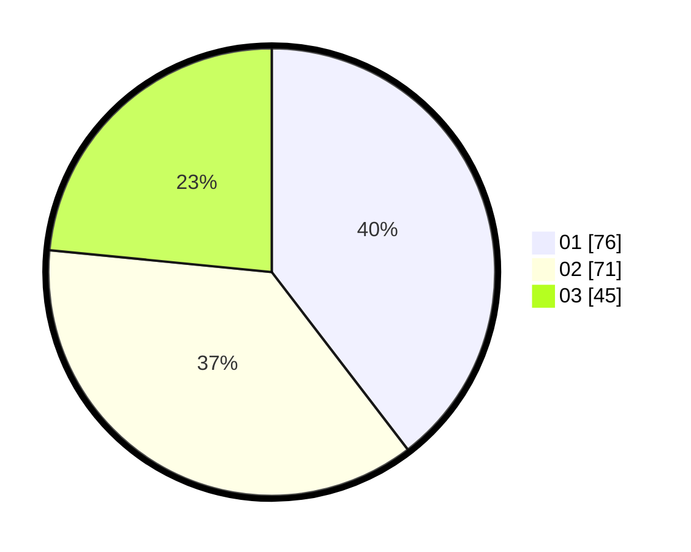

# Hasil

Hasil perolehan suara paslon dapat dilihat pada file paslon-01.txt, paslon-02.txt, dan paslon-03.txt.

Jika tidak ada, artinya data tersebut belum ada pada SIREKAP.

## Perolehan Suara

 * Paslon 01: **76**.
 * Paslon 02: **71**.
 * Paslon 03: **45**.

## Foto C Plano

https://sirekap-obj-formc.kpu.go.id/622e/pemilu/ppwp/31/71/07/10/02/3171071002012-20240214-231943--b7e14a4d-4324-4b75-9c05-80f00a6ef5e4.jpg

https://sirekap-obj-formc.kpu.go.id/622e/pemilu/ppwp/31/71/07/10/02/3171071002012-20240214-232134--5e14d651-fbef-4510-97ec-ccf778b79bc4.jpg

https://sirekap-obj-formc.kpu.go.id/622e/pemilu/ppwp/31/71/07/10/02/3171071002012-20240214-232222--b2a09199-28e5-4a65-8414-0d61042133fa.jpg

## DATA PEMILIH TETAP

Jumlah pemilih dalam DPT: **245**.
 * L: **104**.
 * P: **141**.

## DATA PENGGUNA HAK PILIH

Jumlah pengguna hak pilih dalam DPT: **180**.
 * L: **76**.
 * P: **104**.

Jumlah pengguna hak pilih dalam DPTb: **13**.
 * L: **2**.
 * P: **11**.

Jumlah pengguna hak pilih dalam DPK: **0**.
 * L: **0**.
 * P: **0**.

Jumlah pengguna hak pilih: **193**.
 * L: **78**.
 * P: **115**.

## JUMLAH SUARA SAH DAN TIDAK SAH

JUMLAH SELURUH SUARA SAH: **192**.

JUMLAH SUARA TIDAK SAH: **2**.

JUMLAH SELURUH SUARA SAH DAN SUARA TIDAK SAH: **194**.
