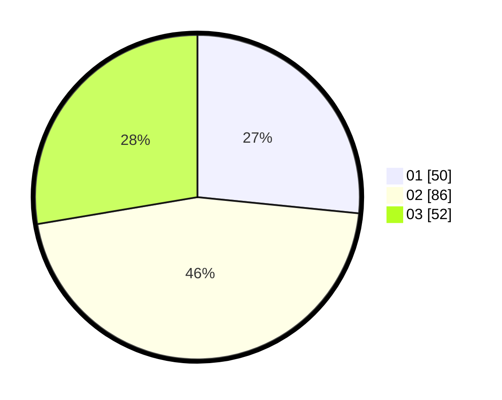

# Hasil

Hasil perolehan suara paslon dapat dilihat pada file paslon-01.txt, paslon-02.txt, dan paslon-03.txt.

Jika tidak ada, artinya data tersebut belum ada pada SIREKAP.

## Perolehan Suara

 * Paslon 01: **50**.
 * Paslon 02: **86**.
 * Paslon 03: **52**.

## Foto C Plano

https://sirekap-obj-formc.kpu.go.id/364b/pemilu/ppwp/31/71/07/10/02/3171071002013-20240216-202651--47d90b80-4997-41be-918d-6ea188de5ad1.jpg

https://sirekap-obj-formc.kpu.go.id/364b/pemilu/ppwp/31/71/07/10/02/3171071002013-20240216-203718--04a68abe-fde3-4a2f-ada3-09985788d462.jpg

https://sirekap-obj-formc.kpu.go.id/364b/pemilu/ppwp/31/71/07/10/02/3171071002013-20240216-203451--2efbb02a-7d82-4d81-aea5-1b06e80ca470.jpg

## DATA PEMILIH TETAP

Jumlah pemilih dalam DPT: **271**.
 * L: **137**.
 * P: **134**.

## DATA PENGGUNA HAK PILIH

Jumlah pengguna hak pilih dalam DPT: **162**.
 * L: **82**.
 * P: **80**.

Jumlah pengguna hak pilih dalam DPTb: **24**.
 * L: **6**.
 * P: **18**.

Jumlah pengguna hak pilih dalam DPK: **4**.
 * L: **2**.
 * P: **2**.

Jumlah pengguna hak pilih: **190**.
 * L: **90**.
 * P: **100**.

## JUMLAH SUARA SAH DAN TIDAK SAH

JUMLAH SELURUH SUARA SAH: **188**.

JUMLAH SUARA TIDAK SAH: **2**.

JUMLAH SELURUH SUARA SAH DAN SUARA TIDAK SAH: **190**.
