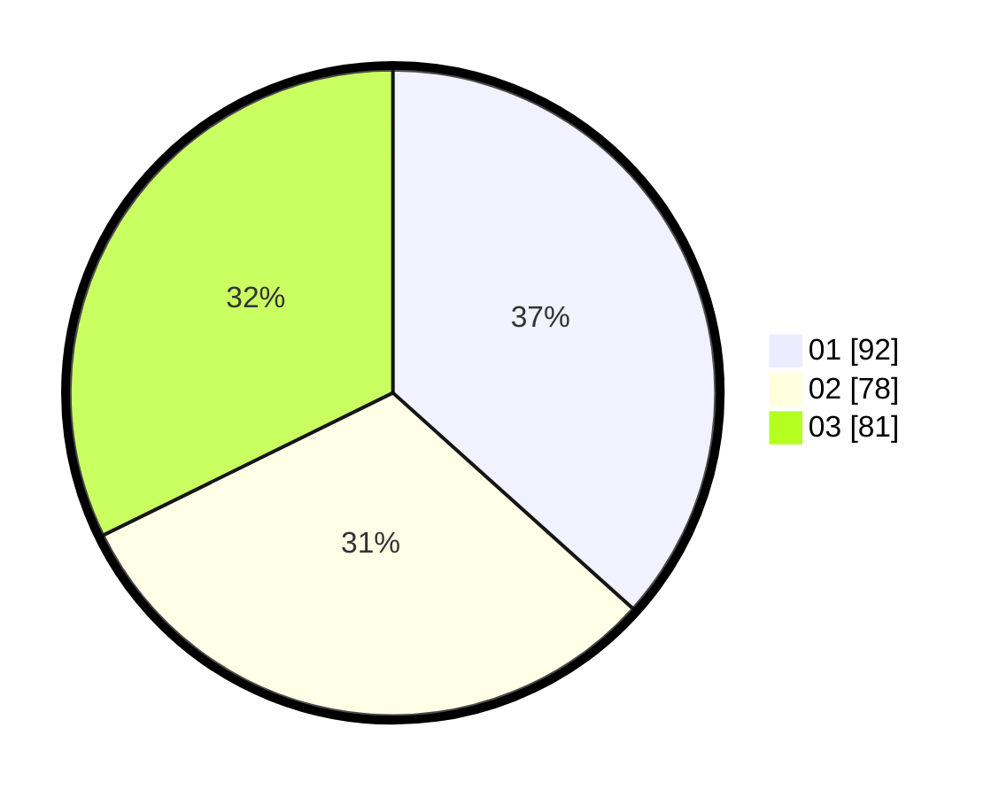

# Hasil

Hasil perolehan suara paslon dapat dilihat pada file paslon-01.txt, paslon-02.txt, dan paslon-03.txt.

Jika tidak ada, artinya data tersebut belum ada pada SIREKAP.

## Perolehan Suara

 * Paslon 01: **92**.
 * Paslon 02: **78**.
 * Paslon 03: **81**.

## Foto C Plano

https://sirekap-obj-formc.kpu.go.id/cf6f/pemilu/ppwp/31/71/07/10/02/3171071002018-20240214-230047--64881331-082c-4d16-955a-a50279cd21e9.jpg

https://sirekap-obj-formc.kpu.go.id/cf6f/pemilu/ppwp/31/71/07/10/02/3171071002018-20240214-230054--5cf88fec-d072-4b26-a0e8-6cef5ddd33cd.jpg

https://sirekap-obj-formc.kpu.go.id/cf6f/pemilu/ppwp/31/71/07/10/02/3171071002018-20240214-230101--9161f846-a761-40c7-9ebb-3b9cabfaf7ed.jpg

## DATA PEMILIH TETAP

Jumlah pemilih dalam DPT: **283**.
 * L: **131**.
 * P: **152**.

## DATA PENGGUNA HAK PILIH

Jumlah pengguna hak pilih dalam DPT: **235**.
 * L: **107**.
 * P: **128**.

Jumlah pengguna hak pilih dalam DPTb: **15**.
 * L: **6**.
 * P: **9**.

Jumlah pengguna hak pilih dalam DPK: **5**.
 * L: **2**.
 * P: **3**.

Jumlah pengguna hak pilih: **255**.
 * L: **115**.
 * P: **140**.

## JUMLAH SUARA SAH DAN TIDAK SAH

JUMLAH SELURUH SUARA SAH: **251**.

JUMLAH SUARA TIDAK SAH: **4**.

JUMLAH SELURUH SUARA SAH DAN SUARA TIDAK SAH: **255**.
