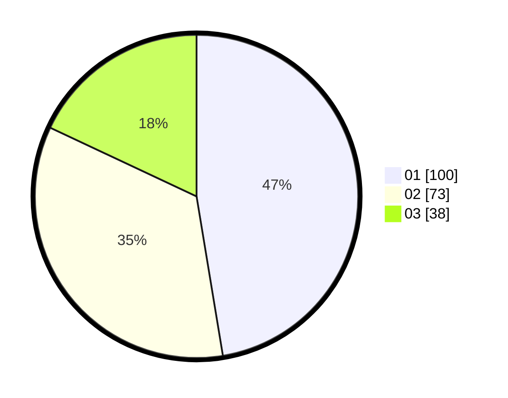

# Hasil

Hasil perolehan suara paslon dapat dilihat pada file paslon-01.txt, paslon-02.txt, dan paslon-03.txt.

Jika tidak ada, artinya data tersebut belum ada pada SIREKAP.

## Perolehan Suara

 * Paslon 01: **100**.
 * Paslon 02: **73**.
 * Paslon 03: **38**.

## Foto C Plano

https://sirekap-obj-formc.kpu.go.id/cf21/pemilu/ppwp/31/71/07/10/02/3171071002021-20240216-193234--37d64c81-6dca-47ec-8791-6bd66d46cf12.jpg

https://sirekap-obj-formc.kpu.go.id/cf21/pemilu/ppwp/31/71/07/10/02/3171071002021-20240216-192712--ffd8abc4-7e27-43a9-9d1c-ad11e4ac54ec.jpg

https://sirekap-obj-formc.kpu.go.id/cf21/pemilu/ppwp/31/71/07/10/02/3171071002021-20240216-213159--da063e05-a197-4ab6-9ce2-6b45af35fad8.jpg
