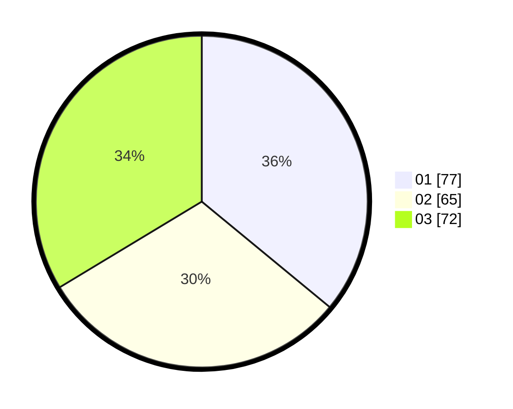

# Hasil

Hasil perolehan suara paslon dapat dilihat pada file paslon-01.txt, paslon-02.txt, dan paslon-03.txt.

Jika tidak ada, artinya data tersebut belum ada pada SIREKAP.

## Perolehan Suara

 * Paslon 01: **77**.
 * Paslon 02: **65**.
 * Paslon 03: **72**.

## Foto C Plano

https://sirekap-obj-formc.kpu.go.id/b311/pemilu/ppwp/31/71/07/10/02/3171071002024-20240214-155616--5747b234-4674-4c88-bf36-a9d28161b036.jpg

https://sirekap-obj-formc.kpu.go.id/b311/pemilu/ppwp/31/71/07/10/02/3171071002024-20240214-230817--f701df5d-ac3e-45f3-b395-5dbb29d7d642.jpg

https://sirekap-obj-formc.kpu.go.id/b311/pemilu/ppwp/31/71/07/10/02/3171071002024-20240214-155449--47a9983a-6e88-4cfd-a872-c1a7b49445a8.jpg

## DATA PEMILIH TETAP

Jumlah pemilih dalam DPT: **197**.
 * L: **95**.
 * P: **102**.

## DATA PENGGUNA HAK PILIH

Jumlah pengguna hak pilih dalam DPT: **268**.
 * L: **123**.
 * P: **145**.

Jumlah pengguna hak pilih dalam DPTb: **17**.
 * L: **4**.
 * P: **13**.

Jumlah pengguna hak pilih dalam DPK: **2**.
 * L: **0**.
 * P: **2**.

Jumlah pengguna hak pilih: **287**.
 * L: **127**.
 * P: **160**.

## JUMLAH SUARA SAH DAN TIDAK SAH

JUMLAH SELURUH SUARA SAH: **214**.

JUMLAH SUARA TIDAK SAH: **2**.

JUMLAH SELURUH SUARA SAH DAN SUARA TIDAK SAH: **216**.
