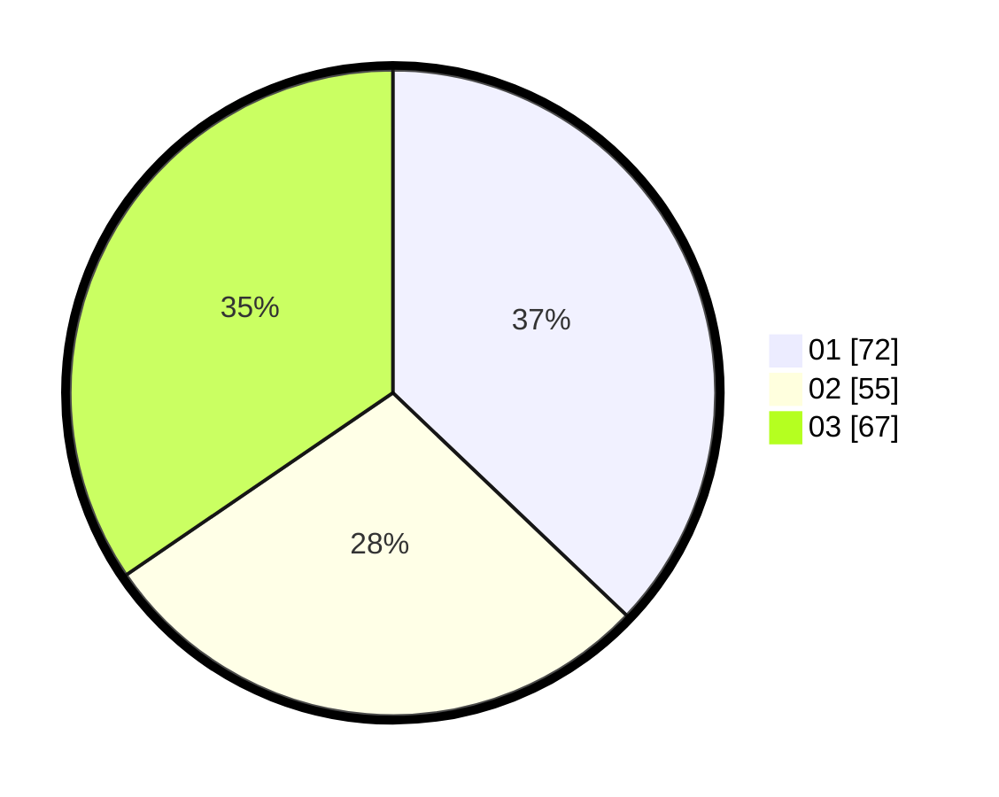

# Hasil

Hasil perolehan suara paslon dapat dilihat pada file paslon-01.txt, paslon-02.txt, dan paslon-03.txt.

Jika tidak ada, artinya data tersebut belum ada pada SIREKAP.

## Perolehan Suara

 * Paslon 01: **72**.
 * Paslon 02: **55**.
 * Paslon 03: **67**.

## Foto C Plano

https://sirekap-obj-formc.kpu.go.id/0088/pemilu/ppwp/31/71/07/10/02/3171071002032-20240218-023316--a3ecfc4a-e7d3-405a-9b04-12b5247a6f73.jpg

https://sirekap-obj-formc.kpu.go.id/0088/pemilu/ppwp/31/71/07/10/02/3171071002032-20240218-023521--da5c6b6b-4166-4f29-a5d4-ae505cc815fc.jpg

https://sirekap-obj-formc.kpu.go.id/0088/pemilu/ppwp/31/71/07/10/02/3171071002032-20240218-023655--cd097d3e-4189-492c-a71b-321da6da961b.jpg

## DATA PEMILIH TETAP

Jumlah pemilih dalam DPT: **249**.
 * L: **129**.
 * P: **120**.

## DATA PENGGUNA HAK PILIH

Jumlah pengguna hak pilih dalam DPT: **186**.
 * L: **98**.
 * P: **88**.

Jumlah pengguna hak pilih dalam DPTb: **19**.
 * L: **5**.
 * P: **14**.

Jumlah pengguna hak pilih dalam DPK: **6**.
 * L: **2**.
 * P: **4**.

Jumlah pengguna hak pilih: **211**.
 * L: **105**.
 * P: **106**.

## JUMLAH SUARA SAH DAN TIDAK SAH

JUMLAH SELURUH SUARA SAH: **206**.

JUMLAH SUARA TIDAK SAH: **5**.

JUMLAH SELURUH SUARA SAH DAN SUARA TIDAK SAH: **211**.
