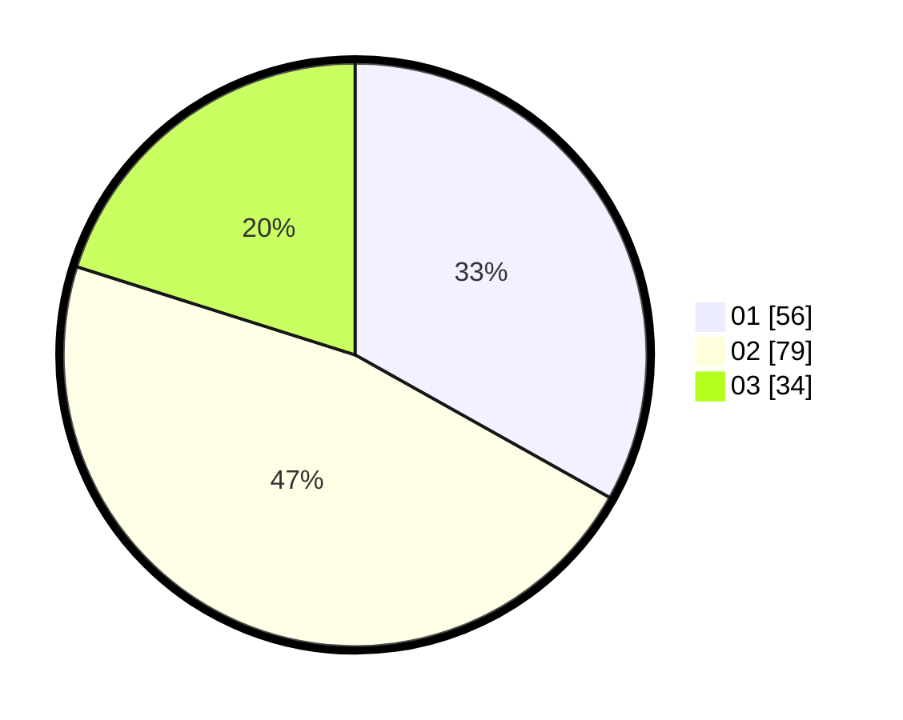

# Hasil

Hasil perolehan suara paslon dapat dilihat pada file paslon-01.txt, paslon-02.txt, dan paslon-03.txt.

Jika tidak ada, artinya data tersebut belum ada pada SIREKAP.

## Perolehan Suara

 * Paslon 01: **56**.
 * Paslon 02: **79**.
 * Paslon 03: **34**.

## Foto C Plano

https://sirekap-obj-formc.kpu.go.id/258c/pemilu/ppwp/31/71/07/10/02/3171071002033-20240214-185523--d9706289-6cf0-4ea8-89bb-bd26441fe3f7.jpg

https://sirekap-obj-formc.kpu.go.id/258c/pemilu/ppwp/31/71/07/10/02/3171071002033-20240214-185542--e23c31dc-2af0-4e32-ad88-fc10c68020d0.jpg

https://sirekap-obj-formc.kpu.go.id/258c/pemilu/ppwp/31/71/07/10/02/3171071002033-20240214-185551--ad9720f7-1f32-48b3-8dd7-53aecda76ee9.jpg
