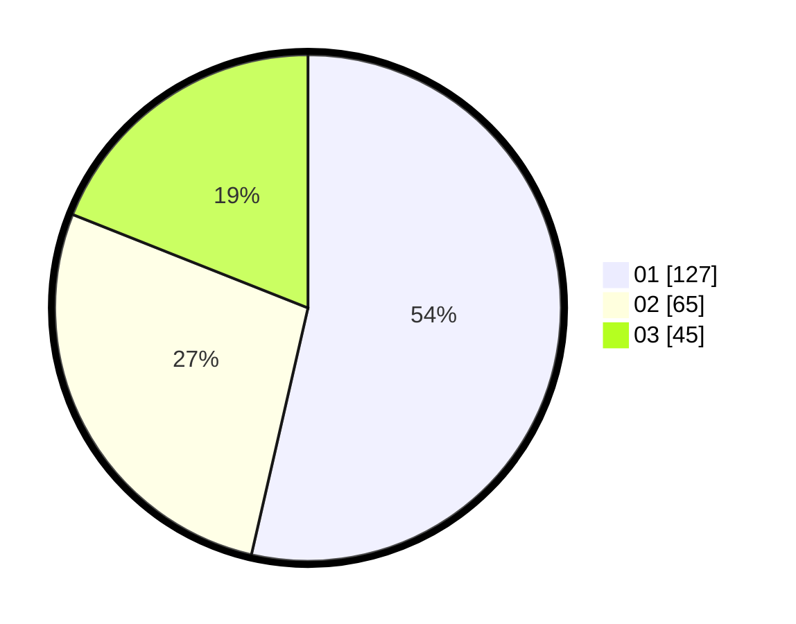

# Hasil

Hasil perolehan suara paslon dapat dilihat pada file paslon-01.txt, paslon-02.txt, dan paslon-03.txt.

Jika tidak ada, artinya data tersebut belum ada pada SIREKAP.

## Perolehan Suara

 * Paslon 01: **127**.
 * Paslon 02: **65**.
 * Paslon 03: **45**.

## Foto C Plano

https://sirekap-obj-formc.kpu.go.id/491e/pemilu/ppwp/31/71/07/10/02/3171071002035-20240214-215921--fd0f2c45-7b7e-4d99-9977-2c219319766d.jpg

https://sirekap-obj-formc.kpu.go.id/491e/pemilu/ppwp/31/71/07/10/02/3171071002035-20240214-193749--9fb61d5a-ef2c-419d-bd50-bfb2c2dc8beb.jpg

https://sirekap-obj-formc.kpu.go.id/491e/pemilu/ppwp/31/71/07/10/02/3171071002035-20240214-220020--b31c4e1a-8898-473d-8950-58273c8ba6ca.jpg

## DATA PEMILIH TETAP

Jumlah pemilih dalam DPT: **279**.
 * L: **127**.
 * P: **152**.

## DATA PENGGUNA HAK PILIH

Jumlah pengguna hak pilih dalam DPT: **205**.
 * L: **95**.
 * P: **110**.

Jumlah pengguna hak pilih dalam DPTb: **31**.
 * L: **14**.
 * P: **17**.

Jumlah pengguna hak pilih dalam DPK: **2**.
 * L: **0**.
 * P: **2**.

Jumlah pengguna hak pilih: **238**.
 * L: **109**.
 * P: **129**.

## JUMLAH SUARA SAH DAN TIDAK SAH

JUMLAH SELURUH SUARA SAH: **237**.

JUMLAH SUARA TIDAK SAH: **1**.

JUMLAH SELURUH SUARA SAH DAN SUARA TIDAK SAH: **238**.
